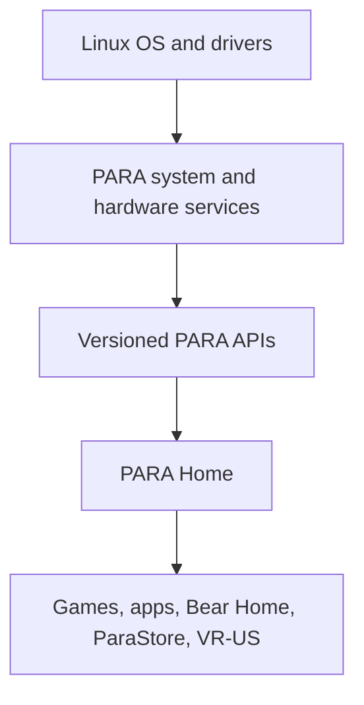

# PARA Project Guide

## 1. What this repository is

PARA `0.1.0-dev` is the first safe development skeleton for a Linux-based home
console/PC hybrid. Linux remains the operating system and owns device drivers,
process isolation, graphics, input, networking, storage, audio, and power
management. PARA adds a console-focused interaction layer above those services.

The current deliverable is a working, dependency-light browser prototype that
boots through the reserved PARA startup sequence, completes a local first-time
setup, shows profile/login shells, enters PARA Home, and navigates every menu in
the build brief. Backend, cloud, commerce, identity, privileged system actions,
and most hardware integration are visibly marked as mock data or stubs.

## 2. Safety promise

The repository is safe to run on a normal development PC:

- The development launcher binds only to a numeric loopback address. A separate
  Render launcher must pass an explicit nonlocal opt-in flag and exposes only
  the mock demo surface.
- No script edits a bootloader, partition table, filesystem, firmware, BIOS/UEFI,
  desktop session, graphics driver, kernel module, or system configuration.
- No systemd unit is copied, installed, enabled, or started automatically.
- Native prototypes either read public Linux metadata or print declared stub
  capabilities. They do not claim hardware.
- Power, formatting, factory reset, optical media, network configuration,
  authentication, purchase, and update actions are disabled or honest stubs.
- Browser `localStorage` is the only state written during the UI flow.

If a future feature needs elevated privileges, put the privileged operation in a
small, separately reviewed service with a narrow D-Bus API and explicit polkit
policy. PARA Home must never shell out to privileged commands.

## 3. Architecture overview

The first required architecture view is:

```text
Linux
  ↓
PARA system services
  ↓
PARA Home
  ↓
Games / Apps
```

The hardware path is:

```text
Hardware
  ↓
Linux drivers
  ↓
PARA hardware services
  ↓
Applications
```

The fuller development boundary is:



Linux drivers remain authoritative. PARA services translate Linux APIs into
stable, capability-scoped PARA APIs. The frontend consumes those APIs and never
needs direct device or root access. Games and apps receive only the interfaces
and permissions they need.

## 4. Repository tree

Generated files such as `__pycache__`, `.para-dev`, `target`, `build`, and `dist`
are intentionally omitted.

```text
PARA/
├── .gitignore
├── Makefile
├── PROJECT_GUIDE.md
├── README.md
├── render.yaml
├── VERSION
├── apps/
│   └── para-home/
│       ├── assets/
│       │   ├── bear-home-room.png
│       │   ├── para-home-background.png
│       │   └── para-home-dashboard.png
│       ├── index.html
│       ├── styles.css
│       └── src/
│           ├── app.js
│           ├── focus-manager.js
│           ├── gamepad.js
│           ├── mock-data.js
│           ├── router.js
│           ├── screen-manifest.js
│           ├── state.js
│           ├── screens/
│           │   ├── auth.js
│           │   ├── boot.js
│           │   ├── home.js
│           │   ├── libraries.js
│           │   ├── social.js
│           │   └── system.js
│           └── ui/
│               └── components.js
├── config/
│   └── services.json
├── interfaces/
│   └── openapi.yaml
├── packages/
│   └── para-protocol/
│       ├── package.json
│       └── src/index.ts
├── platform/
│   └── linux/
│       ├── session/para-home-session.sh
│       └── systemd/user/
│           ├── para-home.target
│           └── para-mock-api.service
├── recovery/
│   └── safe-recovery.sh
├── schemas/
│   └── accounts.sql
├── scripts/
│   ├── check.sh
│   ├── dev.sh
│   ├── native-check.sh
│   ├── render-smoke.sh
│   ├── render-start.sh
│   └── smoke.sh
├── services/
│   ├── mock-api/
│   │   ├── server.py
│   │   └── modules/
│   │       ├── __init__.py
│   │       └── endpoints.py
│   ├── native/
│   │   ├── optical-disc/
│   │   │   ├── CMakeLists.txt
│   │   │   └── src/main.c
│   │   ├── para-hardwared/
│   │   │   ├── Cargo.toml
│   │   │   └── src/main.rs
│   │   └── pulsewave-controller/
│   │       ├── CMakeLists.txt
│   │       └── src/main.cpp
│   └── specs/
│       ├── accounts.toml
│       ├── bear-home.toml
│       ├── hardware.toml
│       ├── network.toml
│       ├── optical.toml
│       ├── parastore.toml
│       ├── pulsewave.toml
│       ├── recovery.toml
│       ├── security.toml
│       ├── updates.toml
│       └── vrus.toml
├── tests/
│   ├── test_api.py
│   └── test_repository.py
└── tools/
    ├── package_release.py
    ├── paractl.py
    └── validate_project.py
```

## 5. Top-level folders

| Folder | What it does and why PARA needs it | Technology | Current status | What comes next / communication boundary |
|---|---|---|---|---|
| `apps/` | Holds user-facing PARA experiences. Keeping UI out of system services prevents presentation code from acquiring hardware privileges. | HTML, CSS, JavaScript | PARA Home works as a navigable prototype. | A compositor-ready shell, packaged apps, media surfaces, and localization. Calls the versioned PARA API only. |
| `config/` | Declares service names, status, type, and privilege expectations in one machine-readable registry. | JSON | Works and is used by validation and the mock API. | Add schema validation, capability versions, dependencies, and build-time generation. |
| `interfaces/` | Defines public service contracts independent of implementation language. | OpenAPI YAML | Documents current GET-only development endpoints. | Add JSON schemas, D-Bus IDL, errors, auth scopes, events, and compatibility rules. |
| `packages/` | Stores code contracts shared by frontend, tools, apps, and services. | TypeScript package | Types exist; no package publishing or code generation yet. | Generate clients from OpenAPI and version contracts semantically. |
| `platform/` | Contains opt-in Linux integration examples while keeping the normal development path unprivileged. | systemd user units, Bash | Examples only; nothing is installed. | Dedicated Wayland session packaging, desktop entry, sandbox profiles, polkit policy, and distro packages after hardware testing. |
| `recovery/` | Reserves recovery as a separate trust boundary instead of hiding destructive actions in PARA Home. | Bash | Harmless status-only shell works. | Signed recovery media, verified package repair, A/B rollback, backup/restore, and dedicated-hardware testing. |
| `schemas/` | Defines local persistent data separately from API/UI code. | SQL (SQLite-compatible proposal) | Account preference schema is a design draft and is not executed. | Migrations, encryption decisions, parental controls, session records, and data-retention policy. |
| `scripts/` | Gives developers consistent safe commands for run, validation, smoke testing, and optional compilation. | Bash | Works without root. | CI jobs, reproducible toolchains, distro matrices, and artifact signing. |
| `services/` | Separates mock backends, native Linux adapters, and service declarations from PARA Home. | Python, Rust, C++, C, TOML | Mock API works; hardware probe is read-only; device services are stubs. | Real D-Bus services using existing Linux drivers and least privilege. |
| `tests/` | Protects route coverage, mock honesty, API safety flags, and repository invariants. | Python `unittest` | Works through `make check`. | UI interaction tests, accessibility audits, contract tests, fuzzing, and dedicated-hardware integration suites. |
| `tools/` | Holds developer-facing inspection, validation, and packaging utilities instead of mixing them into runtime services. | Python | Works without third-party modules. | Developer portal integration, structured logs, trace collection, package/signature tools, and release metadata. |

## 6. Important root files

| File | What / why | Technology | Status | Future additions / communicates with |
|---|---|---|---|---|
| `.gitignore` | Keeps builds, caches, and local developer state out of source control. | Git patterns | Works. | Extend for IDE/tool outputs as the toolchain grows. |
| `Makefile` | Provides memorable `dev`, `check`, `smoke`, `render-check`, `native-check`, and `package` entry points. | Make | Works; delegates to `scripts/` and `tools/`. | Add release, coverage, formatting, and generated-client targets. |
| `README.md` | Gives the shortest safe path to running the prototype. | Markdown | Complete for this milestone. | Add screenshots, supported distro matrix, and contribution guide. |
| `PROJECT_GUIDE.md` | Explains architecture, every important file, status, safety, and next work. | Markdown + Mermaid | Complete for this milestone. | Keep synchronized with service and screen manifests. |
| `render.yaml` | Defines one Render Blueprint web service, validation build command, safe public-demo launcher, and health check. PARA needs this so GitHub-backed demos deploy consistently without changing local safety defaults. | Render Blueprint YAML | Ready for user-triggered deployment; it does not deploy itself. | Add custom-domain policy, preview environments, and production observability only when needed. Talks to `scripts/render-start.sh` and `/api/v1/health`. |
| `VERSION` | Provides one repository version consumed by the API and packager. | Plain text | Works. | Replace with automated release/version policy when stable. |

## 7. PARA Home frontend files

| File | What / why | Technology | Status | Future additions / communicates with |
|---|---|---|---|---|
| `apps/para-home/index.html` | Minimal launch document for the full-screen shell and animated background. PARA needs one deterministic entry point. | Semantic HTML + ES modules | Works. | CSP, production preload policy, compositor/session wrapper. Loads `styles.css` and `src/app.js`. |
| `apps/para-home/assets/bear-home-room.png` | The authoritative full-screen Bear Home room: warm wooden interior, chibi PARA bear, couch, media shelves, desk, glowing collection signs, settings paw, and downloads nook. | 1672×941 PNG illustration | Works as the visual file-manager surface. It is rendered uncropped in a centered 16:9 stage. | Final art optimization, alternate times of day, localization-safe signs, and layered/animated production assets. Used by `src/screens/libraries.js`. |
| `apps/para-home/assets/para-home-background.png` | The approved purple planet, liquid-energy, stars, and reflective-floor scene. PARA needs a strong visual identity without baking menus into the artwork. | 1672×941 PNG illustration | Works as PARA Home’s independent full-screen background layer. It fills the viewport behind real controls and uses a restrained drift/pulse treatment. | Optimized AVIF/WebP variants, HDR grading, parallax layers, and production licensing/provenance records. Used by `src/screens/home.js`. |
| `apps/para-home/assets/para-home-dashboard.png` | Preserves the approved dashboard composition as a design reference for spacing, hierarchy, and visual comparison. | 1672×941 PNG mockup | Reference only; it is deliberately not loaded by the application. | Move to formal design documentation when the component system is stable. |
| `apps/para-home/styles.css` | PARA’s matte-black, white, purple, liquid/wave identity; live Home component system; exact Bear Home artwork stage; TV scaling; loading; disabled/focus states; startup effects. | Modern CSS | Works, including responsive real buttons, mouse-follow card lighting, controller focus animation, uncropped Bear Home, and reduced-motion modes. | Design tokens, local font assets, GPU performance budgets, localization stress tests, HDR/color calibration. |
| `src/app.js` | Composes screens, global navigation, actions, startup routing, diagnostics, clock, state changes, and honest stub toasts. | JavaScript ES modules | Works. | Split action controllers, typed API client, error boundaries, telemetry consent, localization. Talks to all screen modules, router, input managers, state, and `/api/v1/health`. |
| `src/router.js` | Hash router with a small in-app back stack so every menu is reachable without broken links. | JavaScript | Works. | Deep-link policy, route guards, suspended activities, transition lifecycle. Uses `screen-manifest.js`. |
| `src/focus-manager.js` | Reusable spatial focus navigation based on element geometry. It prevents every page from inventing its own controller logic. | JavaScript + DOM APIs | Works for keyboard, pointer, and gamepad-directed movement. | Focus groups, wrap rules, virtualized lists, RTL direction, accessibility announcements. |
| `src/gamepad.js` | Maps Browser Gamepad buttons, D-pad, stick, Menu, and shoulders into shared navigation actions. | JavaScript Browser Gamepad API | Works when the browser exposes a controller; it is not native PulseWave support. | Device identity, controller database, latency telemetry, remapping, haptics, native daemon bridge. Talks to `focus-manager.js` through `app.js`. |
| `src/state.js` | Stores first-boot completion, local login flag, setup step, and visual preferences. | JavaScript + `localStorage` | Works only as local prototype state; not secure authentication. | Encrypted profile service, migrations, parental controls, cloud sync, transactional preferences. |
| `src/mock-data.js` | Central labels for fictional games, apps, downloads, friends, networks, and notices. | JavaScript | Works as explicit display-only mock data. | Replace each dataset with its versioned service API; keep fixtures for tests. |
| `src/screen-manifest.js` | Authoritative route inventory used by router validation and documentation. | JavaScript | Works. | Route capabilities, localization keys, parental ratings, analytics consent tags. |
| `src/ui/components.js` | Reusable topbar, tiles, list rows, panels, progress, hints, and stub notices. | JavaScript HTML templates | Works. | Component tests, sanitization for remote content, virtual lists, theming API. Used by all screen modules. |
| `src/screens/boot.js` | Implements startup placeholder, five-stage intro, and six-step setup wizard. Reserves asset replacement boundaries for fade, liquid mixing, splash/logo reveal, logo melt, beat-reactive orb, and setup. | JavaScript + CSS animation | Works as a placeholder sequence. | Replace stage visuals with signed rendered assets/WebGL and real audio-reactive timing without changing the state router. Talks to `state.js` and `app.js`. |
| `src/screens/auth.js` | Profile selection, add-profile placeholder, guest entry, login, PIN placeholder, and recovery boundary. | JavaScript | Navigation works; identity and security are stubs. | Account backend, passkeys/PIN policy, controller assignment, recovery, parental controls. |
| `src/screens/home.js` | Renders PARA Home as real semantic components over the separate approved background. Every visible nav item, launcher, activity, metric, and shortcut is its own focusable control. | JavaScript HTML templates + inline SVG icons | Works with keyboard, mouse, and controller navigation, live clock/greeting, animated focus, and responsive layout. Calendar, Achievements, Help, and displayed activity/system values explicitly remain placeholders. | Service-driven widgets, Quick Resume, real thermal/storage/network state, personalization, and localization. Talks to the shared router/focus system through `app.js`. |
| `src/screens/libraries.js` | Game/app libraries, ParaStore, Creator Mode, and the full illustrated Bear Home room. Bear Home uses spatial controller-focus hotspots over uncropped artwork and a More drawer for Photos, Games/UGC, Cloud, and Trash. | JavaScript | All screens navigate; the room interaction works while file operations remain honest stubs. | Package manager, licenses, app sandboxing, indexed files, commerce, UGC moderation, developer SDK, and animated/layered Bear Home assets. |
| `src/screens/social.js` | Parties/friends and calls entry screens. | JavaScript | UI works; presence, voice, video, contacts, and history are stubs. | Identity, WebRTC/PipeWire, signaling, consent, block/report/moderation, child safety. |
| `src/screens/system.js` | Notifications, downloads, quick menu, controllers, storage, settings, accessibility, network, account, subscription, power, and recovery. | JavaScript | Navigation and frontend preferences work; system actions remain disabled/stubbed. | One capability-scoped service per system domain; never direct privileged shell calls. |

### Frontend navigation overview

The boot decision is implemented in `state.js` and `app.js`:

```text
Startup
   ↓
First boot complete?
   ├─ No → Intro animation → Setup Wizard → Login/Create Account
   └─ Yes
        ↓
Logged in?
   ├─ No → Login / Profile Selection
   └─ Yes → PARA Home
```

PARA Home’s five large launcher cards expose `Games | ParaStore | Creator |
Social | Settings`. Its top bar also opens ParaStore, Creator, and Settings,
while the Library shortcut opens Apps. Bear Home is available from the Apps
library, so all seven major sections remain reachable without adding controls
that would conflict with the approved dashboard composition.

Settings and home status panels connect the remaining screens: calls,
notifications, downloads, quick menu, controller pairing, storage, system
settings, accessibility, networking, accounts, subscriptions, power, and
recovery. There are no dead links. Selecting an unfinished action shows an
explicit preview-boundary message. Disabled risky actions remain visibly
disabled.

Input behavior:

- D-pad / left stick or Arrow keys: spatial movement.
- Confirm / controller A or Enter: activate the focused control.
- Back / controller B or Escape: return through PARA history.
- Menu or keyboard `M`: open/close Quick Menu.
- Shoulder buttons or Page Up/Page Down: move among major sections.
- Tab and Shift+Tab: native focus cycle.
- Pointer movement and clicks: mouse/touchpad support.

## 8. Backend and contract files

| File | What / why | Technology | Status | Future additions / communicates with |
|---|---|---|---|---|
| `services/mock-api/server.py` | Serves PARA Home and its JSON API. Normal development is loopback-only; public binding requires an explicit launcher flag. It also adds CSP, clickjacking, MIME-sniffing, referrer, and browser-permission headers and disables directory listings. | Python standard library HTTP server | Works in local-development and public-demo modes. | Production ASGI/D-Bus gateway, structured logging, request limits, and stronger caching. Calls `modules/endpoints.py` and serves `apps/para-home`. |
| `services/mock-api/modules/__init__.py` | Marks the endpoint module boundary. | Python | Works. | Domain packages and generated contract bindings. |
| `services/mock-api/modules/endpoints.py` | Supplies health, status, service, hardware, Bear Home, account, store, and component-status data. | Python | Works with explicit mock/read-only results. | Split into real clients per service, validate output against OpenAPI/TypeScript contracts. Reads `config/services.json` and `VERSION`. |
| `interfaces/openapi.yaml` | Documents URL paths and guarantees that current endpoints are read-only development contracts. | OpenAPI 3.1 YAML | Useful documentation; not yet used for generation. | Full schemas, version negotiation, event stream, errors, auth scopes, generated clients. |
| `packages/para-protocol/package.json` | Names the private shared contract package without introducing a frontend build dependency. | JSON/npm metadata | Metadata works; package is not built or published. | TypeScript build, exports, tests, generated types, semantic versioning. |
| `packages/para-protocol/src/index.ts` | Defines service, system, storage, and PulseWave data contracts plus API paths. | TypeScript | Useful compile-time proposal; frontend is not yet consuming the compiled package. | Generate from the authoritative API schema and share with app SDKs. |
| `schemas/accounts.sql` | Proposes local profile/preferences tables and deliberately excludes secrets and payment data. | SQL for SQLite | Placeholder; never executed automatically. | Migration runner, encryption threat model, retention, parent/child relationships, transactions. |

### Backend overview

The current backend is deliberately small: one local Python process serves the
static shell and truthful mock data. It has no write API and no user secrets.
`config/services.json` is the canonical implementation-status inventory.
`interfaces/openapi.yaml` and `packages/para-protocol` reserve language-neutral
and TypeScript contracts for the point when services move into separate
processes.

## 9. Native and Linux integration files

| File | What / why | Technology | Status | Future additions / communicates with |
|---|---|---|---|---|
| `services/native/para-hardwared/Cargo.toml` | Defines a dependency-free Rust hardware-probe crate. | Cargo/Rust | Builds when Rust is installed. | D-Bus, async device events, hwmon/UPower/udev adapters, policy tests. |
| `services/native/para-hardwared/src/main.rs` | Reads counts from procfs/sysfs and emits honest JSON with writes disabled. | Rust | Working read-only probe. | Stable device model, permissions, hotplug, thermal/storage/display capabilities. Reuse Linux APIs rather than drivers. |
| `services/native/pulsewave-controller/CMakeLists.txt` | Defines the native PulseWave stub build. | CMake/C++17 | Works when CMake is used; direct compiler check is in `native-check.sh`. | Link a reviewed input/transport abstraction, not a custom kernel driver. |
| `services/native/pulsewave-controller/src/main.cpp` | Reports controller boundary status and refuses undeclared operations. | C++17 | Compiling stub; no pairing/haptics/firmware. | BlueZ, hidraw/evdev permissions, SDL mapping database, haptics, firmware signing. |
| `services/native/optical-disc/CMakeLists.txt` | Defines the optical stub build. | CMake/C11 | Works when CMake is used. | Link a media coordinator to udev/udisks2. |
| `services/native/optical-disc/src/main.c` | Declares reuse of Linux optical/block/UDF services and performs no media action. | C11 | Compiling stub. | Read-only media discovery first, safe eject, mount mediation, region/DRM legal review, error recovery. |
| `platform/linux/systemd/user/para-home.target` | Shows how PARA user services may be grouped without altering the system boot target. | systemd user unit | Example only; not installed/enabled. | Packaging-owned installation, lifecycle tests, session integration. |
| `platform/linux/systemd/user/para-mock-api.service` | Demonstrates a sandboxed user service with no new privileges and loopback binding. | systemd user unit | Template only; its `%h/PARA` path is illustrative. | Generated install paths, hardening review, socket activation, resource limits. |
| `platform/linux/session/para-home-session.sh` | Documents that the current desktop remains untouched. | Bash | Runs and prints guidance only. | Dedicated Wayland session launcher after compositor selection and testing. |
| `recovery/safe-recovery.sh` | Reports which destructive recovery capabilities are disabled. | Bash | Works and changes nothing. | Signed offline recovery implementation on dedicated hardware. |

### System-service overview

Production PARA should prefer user services for account-specific features and
small system services only where hardware or platform policy requires them.
System services should expose versioned D-Bus APIs, use Linux driver stacks,
drop privileges, declare systemd hardening, validate all caller input, and emit
auditable events. PARA Home should be restartable without restarting Linux or
interrupting games.

### Hardware abstraction overview

`para-hardwared` is the start of the reusable hardware layer. Future adapters
should consume:

- udev for discovery and hotplug;
- sysfs/procfs for read-only capabilities;
- UPower and hwmon for battery/thermal data;
- BlueZ, evdev, hidraw, and the SDL controller database for PulseWave;
- udisks2 and existing SCSI/UDF drivers for optical/external media;
- NetworkManager/iwd for connectivity;
- PipeWire for audio/video routing;
- Wayland/DRM through an established compositor stack;
- OpenXR for VR-US.

PARA should create a custom kernel driver only if hardware truly cannot be
supported through an upstream Linux interface, and even then the preferred path
is upstream contribution and review.

## 10. Service specification files

Every TOML file is a small source-of-truth proposal: service id, present status,
frontend routes, current provider, future runtime, and Linux/security boundary.
The validator makes sure each required domain has one.

| File | PARA role | Present status | Future communication |
|---|---|---|---|
| `services/specs/accounts.toml` | Login, profiles, account, subscriptions | Stub | Identity broker, encrypted session tokens, remote account backend. |
| `services/specs/bear-home.toml` | File collections shared by desktop shell and later VR-US | Mock | xdg user dirs, indexed metadata, udisks2, cloud-provider adapters. |
| `services/specs/hardware.toml` | Stable device/thermal/storage/display capability view | Read-only probe | Rust D-Bus service over udev, sysfs, hwmon, and UPower. |
| `services/specs/network.toml` | Scans, connections, status, offline mode | Stub | Permission-aware NetworkManager/iwd D-Bus adapter. |
| `services/specs/optical.toml` | Disc discovery, mount/eject, media handoff | C stub | udev/udisks2 and existing kernel optical drivers. |
| `services/specs/parastore.toml` | Catalog, packages, licenses, commerce | Mock | Signed catalog/CDN, commerce, entitlement, refund, moderation services. |
| `services/specs/pulsewave.toml` | Controller pairing, input, battery, remap, haptics | Browser prototype + C++ stub | Native daemon over BlueZ/evdev/hidraw/udev. |
| `services/specs/recovery.toml` | Diagnostics, repair, rollback, reset policy | Harmless shell only | Signed recovery environment and verified A/B updates. |
| `services/specs/security.toml` | Sandboxing, signatures, permissions, secrets | Design stub | polkit, systemd sandboxing, Landlock/bubblewrap, signature verifier. |
| `services/specs/updates.toml` | App/system package checks, atomic install, rollback | Design stub | OSTree or systemd-sysupdate evaluation, signed metadata, staged rollout. |
| `services/specs/vrus.toml` | VR-US runtime and Bear Home data reuse | Stub | OpenXR, PipeWire, Wayland, capability-scoped data bridge. |

## 11. Developer, test, and build files

| File | What / why | Technology | Status | Future additions / communicates with |
|---|---|---|---|---|
| `scripts/dev.sh` | Resolves the repository path and starts the loopback server. | Bash | Works. | Optional live reload and structured dev config. Calls `server.py`. |
| `scripts/check.sh` | Runs project validation, unit tests, shell syntax, and Python compilation. | Bash | Works. | JS linter, CSS audit, generated-contract diff, coverage. |
| `scripts/smoke.sh` | Starts an isolated local server, polls health, verifies mock mode, then cleans up. | Bash + Python | Works and is non-destructive. | More route checks and browser automation. |
| `scripts/render-start.sh` | Reads Render's `PORT`, selects public-demo mode, and explicitly permits binding to `0.0.0.0`. Keeping this separate prevents hosted requirements from weakening `make dev`. | Bash | Works; used by `render.yaml`. | Add graceful shutdown tuning or a production server only if load requires it. Calls `server.py`. |
| `scripts/render-smoke.sh` | Starts the public-demo launcher locally and verifies the mode plus security headers through loopback. | Bash + Python | Works and is non-destructive. | Add static asset, cache, and concurrency checks. |
| `scripts/native-check.sh` | Compiles Rust/C++/C components when matching compilers exist and skips absent optional toolchains. | Bash | Works. | CMake presets, sanitizers, clippy, formatting, cross-compilation. |
| `tools/paractl.py` | Inspects status, services, components, and explains how to replay first boot. | Python | Works against a running dev server. | D-Bus transport, log/event viewing, device simulator control, authentication. |
| `tools/validate_project.py` | Enforces screen/service/spec coverage, required files, and absence of destructive script patterns. | Python | Works. | JSON/TOML/OpenAPI schemas, cross-file link checking, package policies. |
| `tools/package_release.py` | Creates a reproducible-layout ZIP while excluding caches/build output. | Python | Works. | Checksums, SBOM, signatures, deterministic timestamps, release channels. |
| `tests/test_api.py` | Verifies health/mock declaration, privileged-action safety, and honest 404s. | Python `unittest` | Works. | Contract fixtures, errors, performance, fuzzing. |
| `tests/test_repository.py` | Verifies route renderers, service status labels, and styled focusable UI conventions. | Python `unittest` | Works. | DOM interaction, visual regression, accessibility, gamepad simulations. |

## 12. Build and run instructions

### Required development dependencies

- Linux, macOS, or Windows with WSL for the supplied shell commands.
- Python 3.11 or newer. Python 3.11 is used because the validator reads TOML
  with the standard-library `tomllib` module.
- Bash 4+ and Make.
- A current browser with ES module support. Chromium, Firefox, and WebKit-based
  browsers are suitable; Gamepad API details vary.

No npm install, database, root permission, kernel headers, or global package
installation is required for the frontend and mock API.

Optional native dependencies:

- Rust and Cargo for `para-hardwared`.
- A C11 compiler for the optical service stub.
- A C++17 compiler for the PulseWave service stub.
- CMake 3.16+ for normal native project generation. The current check script
  can compile the small C/C++ sources directly.
- Node.js for optional `node --check` syntax checks; it is not needed at runtime.

### Run PARA Home

```bash
cd PARA
make dev
```

Open `http://127.0.0.1:4173`.

To replay the entire first-boot flow, open:

```text
http://127.0.0.1:4173/?reset=1
```

The reserved sequence is:

```text
fade-in → purple and white liquid mixing → water splash revealing PARA →
logo melting into a circle → beat-reactive 3D circle → setup screen
```

The present visuals are CSS placeholders designed to be replaced stage by
stage. `activateIntro()` controls stage timing; final video/WebGL assets can be
plugged into the same lifecycle without rewriting startup routing.

### Validate and smoke test

```bash
make check
make smoke
make render-check
make native-check
```

`native-check` is optional; it skips a language when that compiler is absent.

### Deploy from GitHub to Render

Render web services must listen on `0.0.0.0` and should use the platform-provided
`PORT`. The repository keeps that requirement inside `scripts/render-start.sh`;
`make dev` continues to refuse a public bind. Render also recognizes a root
`render.yaml` Blueprint and can use its declared build, start, and health-check
commands.

1. Push the `PARA` repository to GitHub.
2. In Render, choose **New → Blueprint** and connect the GitHub repository.
3. Review the single `para-home-prototype` web service from `render.yaml`.
4. Deploy the Blueprint. No database, secret, persistent disk, or privileged
   service is needed for this prototype.
5. Verify `/api/v1/health` reports `public-demo` and open the generated
   `onrender.com` address.

Official references: [Render Blueprints](https://render.com/docs/infrastructure-as-code),
[Blueprint YAML reference](https://render.com/docs/blueprint-spec), and
[web-service port binding](https://render.com/docs/web-services).

The public demo contains fictional profile and catalog data only. It cannot see
the host PC's controllers, files, network credentials, discs, desktop, Linux
services, or power controls.

### Use the developer CLI

With `make dev` running in another terminal:

```bash
python3 tools/paractl.py status
python3 tools/paractl.py services
python3 tools/paractl.py component pulsewave
python3 tools/paractl.py replay-first-boot
```

### Package a source snapshot

```bash
make package
```

The ZIP is written under `dist/` and excludes caches, compiler outputs, and Git
metadata.

## 13. Current limitations

- The UI is a browser shell, not a dedicated Wayland console session.
- Startup audio and final liquid/splash/logo assets do not exist; CSS reserves
  their timing and replacement points.
- Browser local state is not authentication. PIN, passkeys, recovery, child
  profiles, controller ownership, and cloud sync are absent.
- Games and apps are fictional mock entries; there is no package runtime,
  sandbox, license, compatibility, or Quick Resume implementation.
- ParaStore has no real catalog, commerce, payments, downloads, entitlements,
  refunds, reviews, or moderation.
- Bear Home does not scan, open, copy, move, delete, mount, eject, or upload files.
- Calls, friends, parties, notifications, and presence are mock/stub data.
- Network scans and storage/temperature readings are mock in the frontend API.
- PulseWave native pairing, firmware, haptics, battery, and secure transport are
  absent; browser gamepad navigation is the only working controller layer.
- Optical-disc discovery, mounting, playback, encryption/DRM, and ejection are
  absent.
- VR-US and the 3D Bear Home walk-around are not implemented.
- Updates, package signing, sandboxing, recovery, sleep, restart, shutdown, and
  factory reset are not implemented.
- Accessibility includes useful semantics, keyboard focus, reduced motion,
  large text, and high contrast, but no console TTS or native remapping service.

## 14. Next development milestones

1. **Contract hardening:** make OpenAPI authoritative, add schemas/errors/event
   streams, generate the TypeScript client, and version D-Bus interfaces.
2. **UI verification:** add Playwright navigation tests, controller simulations,
   WCAG audits, 720p/1080p/4K visual regressions, and local font assets.
3. **Dedicated shell experiment:** evaluate a mature Wayland compositor and
   create a separate login-session entry that never replaces an existing desktop.
4. **Read-only hardware services:** expand Rust udev/hwmon/UPower discovery and
   expose it through an unprivileged, testable D-Bus API.
5. **PulseWave prototype:** define HID reports and threat model, use BlueZ and
   evdev/hidraw with udev permissions, contribute mappings upstream where possible.
6. **Bear Home index:** implement read-only XDG directory indexing and external
   media discovery before any write/delete/cloud action.
7. **Application sandbox:** evaluate Flatpak, bubblewrap, portals, cgroups, and
   Landlock; define PARA manifests, permissions, lifecycle, and parental controls.
8. **Identity and social:** design real authentication, passkeys/PIN boundaries,
   encrypted tokens, recovery, child safety, blocking/reporting, and WebRTC media.
9. **Store/package trust:** implement signed manifests, content-addressed
   downloads, license policy, moderation, and a no-commerce development catalog.
10. **Atomic updates and recovery:** choose an established Linux atomic update
    stack, design A/B rollback, sign metadata, and test power-loss/recovery on
    dedicated hardware before exposing any privileged UI action.

## 15. Rules for future contributors

- Label mock, unavailable, and placeholder behavior in code and UI.
- Never convert a disabled system control into a fake success message.
- Reuse upstream Linux APIs and drivers before considering device-specific code.
- Keep PARA Home unprivileged; place hardware/system work behind narrow services.
- Do not install or enable services from `make dev`, tests, or app startup.
- Do not write outside the repository from test or development tooling, except
  ordinary browser-local state and operating-system temporary files.
- Require explicit user confirmation, authorization, integrity verification,
  rollback, and dedicated-hardware testing before destructive features exist.
- Update `config/services.json`, the matching `services/specs/*.toml`, API
  contracts, tests, and this guide together when a stub becomes functional.
