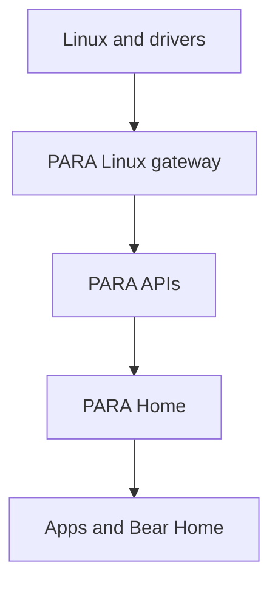

# PARA Project Guide

## Purpose

PARA 0.4.4 is the first working skeleton of a Linux-powered home console/PC
shell. Linux remains the operating system and supplies processes, graphics,
input, filesystems, networking, device discovery, and drivers. PARA supplies a
controller-first consumer interface and narrow service boundaries over those
Linux capabilities.

The current repository boots through the reserved PARA startup sequence,
completes a seven-step first-time setup, supports local profile selection, opens
PARA Home, lists only applications the current runtime can actually open, and
provides a spatial Bear Home file explorer over real user directories and
mounted media. PARA Home now keeps the selected per-profile background visible,
the PARA action opens a persistent Control Center overlay, and local PipeWire
controls appear only when the host exposes them. No fictional catalog,
application, notification, network, storage, or success data is used.

Features without an operational provider are kept out of the consumer route
graph. Their service contracts remain documented for later implementation.

## Safety

The normal launcher is safe to run on a development PC:

- It binds to `127.0.0.1` by default.
- It does not edit a bootloader, `/boot`, partitions, filesystems, firmware,
  BIOS/UEFI, kernel modules, graphics drivers, or the existing desktop.
- It does not install or enable systemd units.
- It does not format, erase, mount, eject, copy, move, rename, or delete user
  documents. It can atomically replace PARA-owned profile preferences and a
  selected wallpaper in XDG config/data directories.
- The gateway uses unprivileged Linux information and local session controls.
  Linux app launch is off
  unless the developer explicitly sets `PARA_ENABLE_APP_LAUNCH=1`.
- Hosted Render instances cannot launch host applications and cannot see files
  from the viewer's computer.
- First-boot/session state remains in browser storage. Personalization is also
  saved per profile under `$XDG_CONFIG_HOME/para` on a local PARA session.

Any future privileged capability must live in a separately reviewed service,
expose a narrow authenticated API, and use explicit Linux policy such as
polkit. The UI process must never receive unrestricted root access.

## Required architecture views

```text
Linux
  ↓
PARA system services
  ↓
PARA Home
  ↓
Games / Apps
```

```text
Hardware
  ↓
Linux drivers
  ↓
PARA hardware services
  ↓
Applications
```

The implemented boundary is:



Linux is the source of truth. PARA does not maintain a second fictional view of
installed software, user directories, storage, network interfaces, controllers,
or system identity.

## Repository tree

Build output, Git metadata, compiler targets, and Python caches are omitted.

```text
PARA/
├── .gitignore
├── Makefile
├── PROJECT_GUIDE.md
├── README.md
├── VERSION
├── render.yaml
├── apps/
│   └── para-home/
│       ├── assets/
│       │   ├── background-aurora-current.png
│       │   ├── background-matte-black.png
│       │   ├── background-midnight-flow.png
│       │   ├── background-violet-horizon.png
│       │   ├── bear-home-room.png
│       │   ├── para-home-background.png
│       │   └── para-logo.png
│       ├── index.html
│       ├── styles.css
│       └── src/
│           ├── app.js
│           ├── focus-manager.js
│           ├── gamepad.js
│           ├── router.js
│           ├── screen-manifest.js
│           ├── services/para-api.js
│           ├── state.js
│           ├── screens/
│           │   ├── auth.js
│           │   ├── boot.js
│           │   ├── home.js
│           │   ├── libraries.js
│           │   ├── personalization.js
│           │   └── system.js
│           └── ui/
│               ├── components.js
│               └── control-center.js
├── config/services.json
├── interfaces/openapi.yaml
├── packages/para-protocol/
│   ├── package.json
│   └── src/index.ts
├── platform/linux/
│   ├── session/para-home-session.sh
│   └── systemd/user/
│       ├── para-gateway.service
│       └── para-home.target
├── recovery/safe-recovery.sh
├── schemas/accounts.sql
├── scripts/
│   ├── check.sh
│   ├── dev.sh
│   ├── native-check.sh
│   ├── render-smoke.sh
│   ├── render-start.sh
│   └── smoke.sh
├── services/
│   ├── gateway/
│   │   ├── server.py
│   │   └── system_layer.py
│   ├── native/
│   │   ├── optical-disc/
│   │   ├── para-hardwared/
│   │   └── pulsewave-controller/
│   └── specs/
│       ├── accounts.toml
│       ├── audio.toml
│       ├── bear-home.toml
│       ├── hardware.toml
│       ├── network.toml
│       ├── optical.toml
│       ├── parastore.toml
│       ├── personalization.toml
│       ├── pulsewave.toml
│       ├── recovery.toml
│       ├── security.toml
│       ├── updates.toml
│       └── vrus.toml
├── tests/
│   ├── test_api.py
│   └── test_repository.py
└── tools/
    ├── audit_consumer_ui.mjs
    ├── package_release.py
    ├── paractl.py
    └── validate_project.py
```

## Top-level folders

| Folder | What it does / why PARA needs it | Technology | Status | Next work and communication |
|---|---|---|---|---|
| `apps/` | Contains the consumer shell. Keeping presentation separate prevents normal UI code from acquiring system privileges. | HTML, CSS, JavaScript ES modules | Working. | Package as a dedicated Linux session after compositor and sandbox decisions. Calls only `services/para-api.js`. |
| `config/` | Machine-readable inventory of current and reserved service domains. | JSON | Working and validated. | Add a JSON Schema, dependency versions, and capability negotiation. Read by repository tooling. |
| `interfaces/` | Language-neutral HTTP contract for the Linux gateway. | OpenAPI 3.1 YAML | Matches the current gateway. | Add schemas, error models, event streams, and a D-Bus contract. Communicates with client generation and tests. |
| `packages/` | Shared type definitions for applications, controllers, services, and API paths. | TypeScript | Types are usable; no published package yet. | Generate types from OpenAPI and publish versioned internal packages. |
| `platform/` | Opt-in Linux session and user-service examples. | systemd user units, Bash | Examples only; never installed automatically. | Add distro packaging, a dedicated Wayland session, sandboxing, and reviewed policies. |
| `recovery/` | Keeps recovery as a separate trust boundary. | Bash | Harmless information command works. | Add signed offline repair and rollback only after dedicated-hardware testing. |
| `schemas/` | Reserves structured local profile/preferences storage without mixing it into UI state. | SQL | Design contract only; not executed. | Add migrations, encryption decisions, retention policy, and a real account service. |
| `scripts/` | Provides consistent run, validation, smoke, Render, and native checks. | Bash | Working without root. | Add CI, reproducible toolchains, linting, accessibility automation, and release signing. |
| `services/` | Holds the working Linux gateway, native interface boundaries, and future service contracts. | Python, Rust, C++, C, TOML | Gateway reads host state and can persist profile settings/control PipeWire locally; native boundaries are interface-only. | Move stable operations behind versioned D-Bus services and least-privilege policies. |
| `tests/` | Protects API truthfulness, route coverage, assets, service safety, and removal of retired routes. | Python `unittest` | Working through `make check`. | Add browser interaction, accessibility-tree, visual-regression, fuzz, and hardware tests. |
| `tools/` | Holds validation, auditing, packaging, and operator inspection outside the consumer shell. | Python, JavaScript | Working. | Add deterministic packages, SBOM/signatures, generated clients, and release metadata. |

## Important root files

| File | What / why | Technology | Status | Next work / communicates with |
|---|---|---|---|---|
| `.gitignore` | Excludes caches, build directories, generated archives, and native check output. | Git patterns | Working. | Extend when new toolchains are added. |
| `Makefile` | Stable entry points: `dev`, `check`, `smoke`, `render-check`, `native-check`, and `package`. | Make | Working. | Add release, formatting, coverage, and client-generation targets. Delegates to `scripts/` and `tools/`. |
| `README.md` | Short run/deploy handoff. | Markdown | Current. | Add screenshots and distro compatibility after real hardware testing. |
| `PROJECT_GUIDE.md` | Complete architecture and file-by-file status. | Markdown + Mermaid | Current. | Keep synchronized with routes, service specs, and deployment behavior. |
| `VERSION` | Single source for gateway and archive version. | Plain text | `0.4.4`. | Automate from signed releases later. |
| `render.yaml` | Render Blueprint build, start, and health-check configuration. | YAML | Working. | Add a production observability policy if PARA is publicly operated. Calls `scripts/render-start.sh`. |

## PARA Home frontend

| File | What / why | Technology | Status | Next work / communicates with |
|---|---|---|---|---|
| `apps/para-home/index.html` | Minimal full-screen launch document and accessibility live regions. | HTML5 + ES modules | Working. | Add production preload/local font policy. Loads `styles.css` and `src/app.js`. |
| `assets/background-aurora-current.png` | Supplied Aurora Current artwork and the official restored/default profile wallpaper. | PNG, 1672×941 RGBA | Working and preserved byte-for-byte. | Add optimized source-controlled derivatives without replacing the original. Read by `state.js` and `personalization.js`. |
| `assets/background-violet-horizon.png` | Supplied Violet Horizon built-in wallpaper. | PNG, 1672×941 RGBA | Working and preserved byte-for-byte. | Add licensed source records and optimized display variants. Read by `state.js` and `personalization.js`. |
| `assets/background-midnight-flow.png` | Supplied Midnight Flow built-in wallpaper. | PNG, 1672×941 RGBA | Working and preserved byte-for-byte. | Add licensed source records and optimized display variants. Read by `state.js` and `personalization.js`. |
| `assets/background-matte-black.png` | Supplied Matte Black built-in wallpaper. | PNG, 1672×941 RGBA | Working and preserved byte-for-byte. | Add licensed source records and optimized display variants. Read by `state.js` and `personalization.js`. |
| `assets/para-home-background.png` | Earlier independent purple planet source artwork retained for project history; it is not a selectable wallpaper. | PNG | Asset only. | Remove in a later asset cleanup after release migration review. No runtime file communicates with it. |
| `assets/para-logo.png` | Official PARA logo supplied by the project owner and used byte-for-byte for system branding. | PNG with alpha | Working; proportions and colors are unchanged. | Add vector/export variants only from the official source artwork. Used by `components.js`, `home.js`, and the startup sequence in `boot.js`. |
| `assets/bear-home-room.png` | Clean 1672×941 room + furniture + PARA bear with zero baked interface. | PNG | Working and preserved byte-for-byte from the supplied art. | Add separate animation layers when proper assets exist. Used only by `libraries.js`. |
| `styles.css` | Complete consumer design system: black/purple atmosphere, translucent panels, console spacing, 180–250 ms focus motion, disabled states, setup, apps, Bear Home, and system pages. | Modern responsive CSS | Working. | Add local fonts, HDR tokens, localization stress tests, and performance budgets. |
| `src/app.js` | Runtime composition, route transitions, Control Center lifecycle, profile hydration, actions, controller prompts, and service activation. | JavaScript | Working. | Split domain controllers and add typed error boundaries. Talks to every screen, router, input, state, overlay, and API adapter. |
| `src/router.js` | Restricts navigation to the screen manifest and keeps an in-shell back stack. | JavaScript + hash routing | Working. | Add route guards and activity suspension when real games/apps exist. |
| `src/focus-manager.js` | Geometry-based directional focus, pointer focus, range adjustment, Tab compatibility, Enter, Escape, PARA tap/hold, and shoulder navigation. | JavaScript DOM APIs | Working. | Add wrap policies, virtual lists, RTL, focus groups, and announcements. |
| `src/gamepad.js` | Normalizes Browser Gamepad input, detects controller families, and maps a dedicated or fallback button to PARA tap/hold. | JavaScript Gamepad API | Working when the browser exposes a controller. | Connect to a native controller service for remapping, battery, haptics, and hotplug metadata. |
| `src/state.js` | Stores first boot, local session, accessibility, selected Bear collection, and separate background/Control Center preferences for every profile. It maps the four built-in wallpaper ids to the supplied image files and still reads older profile ids safely. | JavaScript `localStorage` plus gateway synchronization | Working; selected wallpaper, fitting, and dimming survive navigation and restart. It is not an identity store. | Move identity and authorization to a versioned account service while retaining per-profile settings. |
| `src/screen-manifest.js` | Authoritative set of 23 reachable screens. The Control Center is an overlay, not a route. | JavaScript | Working and validated. | Add capability-gated route registration for installed integrations. |
| `src/services/para-api.js` | One client boundary for capabilities, applications, host state, PipeWire controls, profile personalization, files, and custom-image upload. | JavaScript Fetch API | Working. | Generate it from OpenAPI and add typed cancellation/retry policy. Talks only to `/api/v1`. |
| `src/ui/components.js` | Shared brand, living background, page frame, tiles, list rows, toggles, progress, and dynamic controller legends. | JavaScript templates | Working. Controls without a route or action render disabled. | Move to tested Web Components or another compositor-compatible UI toolkit. |
| `src/screens/boot.js` | Startup, five reserved intro stages, and Welcome → Display → Network → Accessibility → Privacy → Account/Profile → Ready setup. | JavaScript + CSS animation | Working. Display/network values are live; final rendered startup assets do not exist yet. | Replace each animation stage without changing routing; add real calibration providers. |
| `src/screens/auth.js` | “Who’s playing?”, Player One, Guest, selected-profile Continue, and Switch Profile. | JavaScript | Working as a local session flow. | Add a genuine identity provider before exposing PIN, recovery, or remote accounts. |
| `src/screens/home.js` | Wallpaper-first PARA Home with exactly Continue, Explore, Create, Community, and System as a single horizontal tab row. Focus replaces one contextual strip; Explore and Create consume discovered applications, while System exposes only capability-backed actions. | JavaScript + inline SVG | Working. No Home dashboard cards, permanent widgets, fictional activity, or invented statistics are rendered. | Add resumable-activity and community providers; their existing quiet states will then be replaced with real content. Communicates with `para-api.js`, `state.js`, controller state, and the shared focus manager. |
| `src/screens/libraries.js` | Installed Apps from the gateway, launch routing, clean Bear Home art, capability-gated spatial hotspots, and read-only file lists. | JavaScript | Working. Bear Home is one app; room controls exist only for readable folders or mounted media. | Add file opening via portals, indexed media, thumbnails, and mounted-volume navigation after permission design. |
| `src/screens/personalization.js` | Renders the four supplied built-ins first, live focus preview, click/confirm selection, staged Apply/Cancel, fitting, dimming, default restoration, then the separate custom-background chooser. It also owns Control Center arrangement. | JavaScript DOM events + platform file input | Working. A card press moves focus to the always-visible Apply action; built-ins work everywhere. The PNG/JPEG/WebP system chooser and upload appear only in a writable local Linux session. | Add approved-background policy once the account permission service exists. Communicates with `state.js`, `para-api.js`, and the shared focus manager. |
| `src/screens/system.js` | Controller state, storage, settings, display, accessibility, network, account, power, health, and recovery. | JavaScript | Working with live information and safe local interface actions. | Add new pages only when a real system provider and safe action contract exist. |
| `src/ui/control-center.js` | Builds the overlay without leaving the active route and filters controls against actual gateway/controller capability. | JavaScript templates + Fetch | Working. Notifications and app switching are absent because no provider exists. | Add providers for running apps and notifications, then expose them automatically. |

## Frontend navigation

```text
Startup
   ↓
First boot complete?
   ├─ No → Intro animation → Setup Wizard → PARA Home
   └─ Yes
        ↓
Logged in?
   ├─ No → Profile Selection → Login
   └─ Yes → PARA Home
```

PARA Home retains the required five primary items in one horizontal row. They
behave as contextual tabs, not giant cards or website links:

- `Continue` — shows a quiet empty state until a resumable application is
  reported.
- `Explore` — reveals only applications returned by the Linux/PARA application
  service; selecting an application routes to or launches that exact item.
- `Create` — filters the same detected application list by actual desktop-entry
  categories and known creator-tool names.
- `Community` — stays visually quiet while no communication provider exists.
- `System` — reveals a compact row containing Settings and only the system
  actions supported by current capability/controller state.

Moving focus between these five items replaces the previous context in roughly
220 ms. The selected item grows slightly, brightens, and gains a restrained
purple underline. The wallpaper remains the dominant surface and subtly shifts
its ambient light by section.

Reachable screens are Startup, Intro, Setup, Login, Profiles, Home, Apps, Bear
Home, Files, Downloads, Controllers, Storage, Settings, Personalization,
Background, Control Center settings, Display, Accessibility,
Network, Account, Power, Repair & Health, and Recovery. Control Center floats
over any of these screens without changing the current route.

Input mapping:

- D-pad / left stick or Arrow keys: nearest control in that direction.
- Connected controller primary control or Enter: select.
- Connected controller back control or Escape: back.
- Tap the mapped PARA button or keyboard `M`: open/close Control Center.
- Hold the mapped PARA button or keyboard `M` for 650 ms: return Home.
- Shoulder buttons or Page Up/Page Down: switch major sections.
- Tab / Shift+Tab: browser focus order.
- Pointer hover/click: the same controls as keyboard/controller.

Prompt labels are controller-aware. Xbox uses A/B/X/Y, PlayStation symbols are
shown only for an identified PlayStation controller, Nintendo uses its layout,
and generic/PARA controls use Blue/Red/Green/Yellow names.

## Control Center and personalization

A short PARA action opens `#para-overlay` above the current route; closing it
returns focus to the exact previous control. The gateway capability response is
the filter for Network, Audio, and Microphone. Browser Gamepad connection state
is the filter for Controllers. Home, Profile, Quick Settings, and session Power
are always valid shell actions. Running-app switching and notifications do not
render because their providers do not exist.

Settings → Personalization → Background presents Aurora Current, Violet
Horizon, Midnight Flow, and Matte Black as large thumbnails backed by the four
supplied PNG files. Controller, keyboard, or pointer focus previews one image
live behind the settings interface. Apply commits the staged image; Cancel
restores the profile's saved choice. Fill, Fit, Center, Stretch, and dimming
apply through the same profile preference. Restore PARA Default selects Aurora
Current with PARA's standard fit and dimming.

Only after those four built-ins, a writable local Linux session reveals **Add
Custom Background**. Its platform file input opens the system chooser and
accepts verified PNG, JPEG, or WebP bytes. The gateway stores the image under
`$XDG_DATA_HOME/para/backgrounds` and atomically stores the profile preference
under `$XDG_CONFIG_HOME/para/profiles`; both survive shell and Linux restarts.
Each profile has an independent preference document and custom-image filename
derived from a one-way profile key. Login and profile selection use the neutral
PARA background and never load the selected user's wallpaper before login.

Control Center order/visibility is also per profile. The code reserves
the settings boundary for a future `Allow Custom Backgrounds` account policy,
but does not claim to enforce family permissions before an account authority
exists.

## Bear Home architecture

The background image contains no controls. `libraries.js` can overlay semantic
buttons on the TV, disc shelf, record player, desk, door, under-stairs storage,
and PARA bear. A room-object button is created only when its XDG folder is
readable or its corresponding device is actually mounted; the bear menu remains
available. Percentage coordinates remain aligned because the stage is
locked to the artwork's 1672:941 aspect ratio and uses `object-fit: contain`.

Labels are hidden until hover/focus. The shared focus manager compares element
geometry, so directional input chooses the nearest object in the requested
direction instead of walking an arbitrary list. Selecting a category asks the
gateway for the corresponding XDG directory or mounted-media collection.

## Backend and Linux gateway

| File | What / why | Technology | Status | Next work / communicates with |
|---|---|---|---|---|
| `services/gateway/server.py` | Serves PARA Home plus versioned JSON/image endpoints, security headers, bind policy, bounded request validation, and optional app launch. | Python standard library HTTP server | Working. Hosted binds disable local writes and controls. | Replace transport for production scale while retaining the API and safety policy. Calls `system_layer.py`. |
| `services/gateway/system_layer.py` | Reads identity, storage, network, XDG folders, apps, and mounts; classifies detected application roles from real desktop metadata; controls PipeWire through exact `wpctl` arguments; validates and atomically persists per-profile settings and PNG/JPEG/WebP backgrounds. | Python standard library + Linux files/APIs + `gio`/`wpctl` | Working for unprivileged local sessions; app launch remains explicit opt-in. | Split domains into narrow D-Bus/portal services, add account authorization, udev/udisks2 events, and transactional migrations. |
| `interfaces/openapi.yaml` | Contract for all gateway endpoints. | OpenAPI 3.1 | Current. | Add complete component schemas and generated clients. |
| `packages/para-protocol/src/index.ts` | Shared API/controller/application types. | TypeScript | Current source package. | Generate from OpenAPI and publish internally. |
| `config/services.json` | Declares operational and contract-only domains. | JSON | Working. | Add schema validation and runtime capability discovery. |

Application discovery is intentionally conservative. Linux `.desktop` entries
are returned only when all of these are true:

1. PARA is bound locally.
2. `PARA_ENABLE_APP_LAUNCH=1` was explicitly set.
3. `gio` exists.
4. The entry is visible, identifies an application, and satisfies `TryExec`.

The server stores the exact discovered desktop-file path internally. The client
submits only the returned identifier, and the gateway launches only a currently
rediscovered exact entry. It does not execute shell text from the UI.

## Native and service-boundary files

| File | PARA role | Language | Status | Eventual addition / communication |
|---|---|---|---|---|
| `services/native/para-hardwared/src/main.rs` | Demonstrates safe procfs/sysfs discovery without writes. | Rust | Working read-only probe. | D-Bus hardware capability service over udev, hwmon, and UPower. |
| `services/native/para-hardwared/Cargo.toml` | Rust crate definition. | TOML/Cargo | Working. | Add dependencies only when a real daemon is designed. |
| `services/native/pulsewave-controller/src/main.cpp` | Declares the native controller boundary without claiming devices. | C++17 | Interface-only executable. | BlueZ/evdev/hidraw adapter, SDL mappings, permissions, haptics, and firmware policy. |
| `services/native/pulsewave-controller/CMakeLists.txt` | Builds the controller boundary. | CMake | Working. | Tests, sanitizers, packaging, and daemon install rules after implementation. |
| `services/native/optical-disc/src/main.c` | Declares the optical boundary while reusing Linux optical drivers. | C11 | Interface-only executable. | udev/udisks2 discovery, safe mount/eject policy, media handoff, and error reporting. |
| `services/native/optical-disc/CMakeLists.txt` | Builds the optical boundary. | CMake | Working. | Tests and packaging after operations exist. |

Service specs are honest design contracts and are not rendered in the consumer
UI:

| Spec | Current status | Eventually communicates with |
|---|---|---|
| `accounts.toml` | Local session | Identity broker, encrypted tokens, parental controls. |
| `audio.toml` | Local PipeWire session | Event-driven volume, microphone, routing, and accessory state. |
| `bear-home.toml` | Read-only | XDG directories, udisks2, indexing, portals. |
| `hardware.toml` | Read-only | udev, sysfs, procfs, UPower, hwmon. |
| `network.toml` | Read-only | Permission-aware network service when configuration is allowed. |
| `optical.toml` | Mounted-media read-only | udev, udisks2, existing SCSI/UDF drivers. |
| `pulsewave.toml` | Browser Gamepad | Native controller daemon and shared mapping database. |
| `recovery.toml` | Interface actions | Signed recovery image and verified rollback. |
| `parastore.toml` | Contract only; no route | Signed catalog, packages, entitlements, payments, moderation. |
| `personalization.toml` | Local session | Account-authorized per-profile settings portal and family policy. |
| `security.toml` | Contract only; no route | polkit, systemd sandboxing, Landlock/bubblewrap, signature verification. |
| `updates.toml` | Contract only; no route | Signed atomic updater with rollback. |
| `vrus.toml` | Contract only; no route | OpenXR, PipeWire, Wayland, and capability-scoped Bear Home data. |

## Other important platform files

| File | What / why | Technology | Status | Next work / communicates with |
|---|---|---|---|---|
| `platform/linux/systemd/user/para-gateway.service` | Hardened user-service template for a future local install. | systemd | Template only and never enabled automatically. | Package with reviewed paths and desktop-session integration. Starts the gateway locally. |
| `platform/linux/systemd/user/para-home.target` | Groups future PARA user services. | systemd | Template only. | Add explicit dependencies after services exist. |
| `platform/linux/session/para-home-session.sh` | States that the current desktop remains untouched. | Bash | Working information command. | Replace with a dedicated opt-in Wayland session launcher after testing. |
| `recovery/safe-recovery.sh` | Lists destructive categories kept disabled and points to repository diagnostics. | Bash | Working and non-destructive. | Signed offline repair tooling. |
| `schemas/accounts.sql` | Proposed local profile and preference tables without secrets/payment data. | SQL | Not executed. | Migration runner, encryption policy, ownership, and retention rules. |

## Developer and validation files

| File | What / why | Technology | Status | Next work / communicates with |
|---|---|---|---|---|
| `scripts/dev.sh` | Starts the loopback gateway; optional app launch requires an environment flag. | Bash | Working. | Live reload and structured logging. |
| `scripts/render-start.sh` | Binds to Render's `PORT` with explicit nonlocal permission and no app launching. | Bash | Working. | Replace transport only if traffic requires it. |
| `scripts/check.sh` | Runs structural validation, consumer-copy audit, browser entry-module parsing, unit tests, shell syntax, and Python compilation. | Bash | Working. | Add CSS lint, browser accessibility, and contract diffs. |
| `scripts/smoke.sh` | Starts a temporary local gateway and checks health. | Bash + Python | Working. | Add endpoint and concurrency checks. |
| `scripts/render-smoke.sh` | Tests the hosted start path and security headers on loopback. | Bash + Python | Working. | Add static cache and graceful-shutdown checks. |
| `scripts/native-check.sh` | Compiles native boundaries when compilers are installed. | Bash | Working; skips absent optional compilers. | Add CMake presets, clippy, sanitizers, and cross-builds. |
| `tools/validate_project.py` | Enforces routes, services, specs, required files, and absence of destructive script patterns. | Python | Working. | Validate JSON/OpenAPI schemas and cross-file links. |
| `tools/audit_consumer_ui.mjs` | Renders every screen and setup step, then rejects engineering copy or dead-action markers. | JavaScript | Working when Node is installed. | Add browser accessibility-tree and localization audits. |
| `tools/paractl.py` | Reads health, capabilities, system, storage, network, audio, apps, directories, and one profile's personalization. | Python | Working against a running gateway. | Add D-Bus/event inspection once native services exist. |
| `tools/package_release.py` | Produces a source archive while excluding Git, caches, builds, and prior archives. | Python | Working. | Add reproducible timestamps, checksums, SBOM, and signatures. |
| `tests/test_api.py` | Verifies gateway health, host-backed values, hidden app launch, desktop-metadata application roles, 404s, and public-bind policy. | Python `unittest` | Working. | Add malformed input, concurrency, and fuzz tests. |
| `tests/test_repository.py` | Verifies route renderers, exact clean Bear art, capability-gated hotspots, the five-item contextual Home, PARA tap/hold, consumer copy, Render wiring, and retired-code removal. | Python `unittest` | Working. | Add DOM interaction and visual-regression tests. |

## Build and run

### Required dependencies

- Python 3.11 or newer.
- Bash 4+ and Make.
- A current browser with JavaScript modules.

Node is optional and enables the consumer-copy audit. Rust/Cargo, a C11
compiler, a C++17 compiler, and CMake are optional for native checks. No npm
install, database, Supabase project, secret, root access, or kernel headers are
required for PARA Home.

### Run locally

```bash
cd PARA
make dev
```

Open `http://127.0.0.1:4173`.

Replay first boot:

```text
http://127.0.0.1:4173/?reset=1
```

The reserved startup sequence is:

```text
fade-in → purple and white liquid mixing → water splash revealing the PARA logo
→ logo melting into a circle → 3D circle reacting to a beat → setup screen
```

### Show and launch installed Linux desktop apps

This is local-only and explicitly opt-in:

```bash
PARA_ENABLE_APP_LAUNCH=1 make dev
```

Without that flag, Apps contains only working built-in PARA applications, which
currently means Bear Home. Render never enables Linux application launching.

### Validate

```bash
make check
make smoke
make render-check
make native-check
```

### Package

```bash
make package
```

The archive is written to `dist/PARA-0.4.4.zip`.

## Render deployment

Push the repository to GitHub, create a Render Blueprint, and select this repo.
The included settings are:

- Build command: `./scripts/check.sh`
- Start command: `./scripts/render-start.sh`
- Health check: `/api/v1/health`

No environment variables or Supabase keys are required. Render supplies `PORT`
automatically. The hosted interface can show Bear Home and its layout, but it
cannot read a viewer's directories or launch a viewer's Linux applications;
those capabilities require the local gateway on that machine.

## Current limitations

- PARA Home currently runs in a browser, not a dedicated Wayland session.
- The intro reserves the required stages with CSS; final rendered audio/video or
  WebGL assets do not exist.
- Local profiles are session preferences, not authenticated identities.
- Bear Home reads directory names and file metadata but does not open or mutate
  files.
- External and optical media are shown only after Linux has mounted them.
- Linux application discovery/launch is intentionally disabled unless explicitly
  enabled on a loopback run.
- Continue and Community currently show quiet empty states because resumable
  activity and communication providers do not exist. Create lists detected
  creator applications when local application discovery is explicitly enabled.
- Running-application switching and notifications are omitted from Control
  Center until real lifecycle and notification providers exist.
- Static backgrounds, fit, and dimming work; animated backgrounds are
  intentionally deferred until native shell lifecycle and resource limits exist.
- ParaStore, remote accounts, purchases, downloads/installation, updates,
  VR-US, social communication, native PulseWave operations, optical controls,
  and privileged recovery are not exposed.
- Screen reader, captions, controller assistance, HDR calibration, safe-area
  calibration, and native controller remapping need real system providers before
  they can be offered.

## Next milestones

1. Replace the standard-library HTTP transport with a typed local D-Bus/portal
   boundary while preserving the OpenAPI-compatible client contract.
2. Add safe document portals for opening selected files without broad filesystem
   access.
3. Build the installed-app service around desktop portals, application lifecycle,
   sandbox permissions, and capability reporting.
4. Add real media indexing/thumbnails and hotplug events for Bear Home.
5. Implement a native controller service using existing Linux input stacks and a
   shared mapping database.
6. Design signed package, update, entitlement, security, and recovery systems
   before exposing ParaStore or privileged controls.
7. Add a real account/permission provider for parental background approvals and
   policy enforcement without exposing one profile's wallpaper at login.
8. Package PARA Home as an opt-in dedicated Linux session and test it on target
   hardware without replacing existing desktop sessions.
