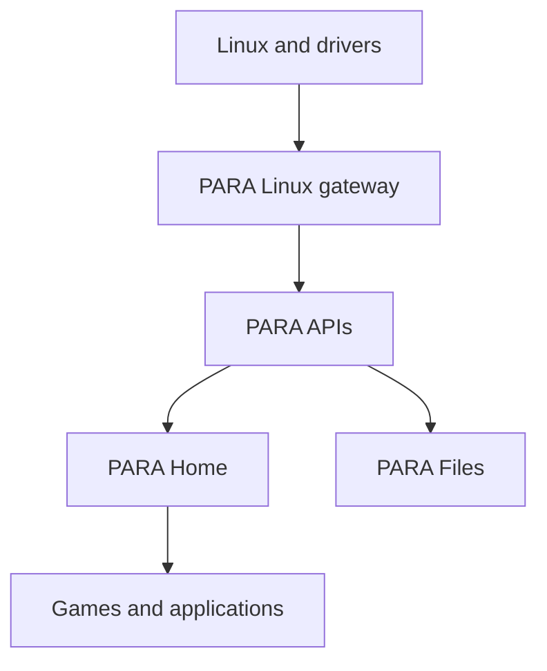

# PARA Project Guide

## Purpose

PARA 0.7.1 is the working skeleton of a Linux-powered home console/PC
shell. Linux remains the operating system and supplies processes, graphics,
input, filesystems, networking, device discovery, and drivers. PARA supplies a
controller-first consumer interface and narrow service boundaries over those
Linux capabilities.

The current repository boots through an exact eight-second PARA ignition,
completes a 14-chapter first-time setup, supports local profile selection, opens
PARA Home, lists only applications the current runtime can actually open, and
provides a classic PARA Files interface over real Linux directories and mounted
media. PARA Home keeps the selected per-profile background visible. Continue,
Switcher, demo installs, creator work, notifications, Marks, preferences, and
the local demo-storage total persist separately for each profile. The PARA
action opens a compact contextual Control Center overlay; local PipeWire
controls appear when exposed and browser-owned sound/microphone controls use
real browser APIs. Linux system information is never replaced by invented data.

Features without an operational provider are kept out of the consumer route
graph. Their service contracts remain documented for later implementation.

## Safety

The normal launcher is safe to run on a development PC:

- It binds to `127.0.0.1` by default.
- It does not edit a bootloader, `/boot`, partitions, filesystems, firmware,
  BIOS/UEFI, kernel modules, graphics drivers, or the existing desktop.
- It does not install or enable systemd units.
- It never formats or erases storage. File opening, creation, rename, copy,
  move, Trash, restore, mount, unmount, and eject controls are absent in the
  default run. Those actions exist only on a loopback session deliberately
  started with `PARA_ENABLE_FILE_OPERATIONS=1`.
- It can atomically replace PARA-owned profile preferences and a selected
  wallpaper in XDG config/data directories.
- The gateway uses unprivileged Linux information and local session controls.
  Linux app launch is off
  unless the developer explicitly sets `PARA_ENABLE_APP_LAUNCH=1`.
- Suspend, reboot, and poweroff are visual session actions by default. Fixed
  Linux `systemctl` calls remain off unless a local operator deliberately starts
  PARA with `PARA_ENABLE_POWER_ACTIONS=1`; Render never enables them.
- Hosted Render instances cannot launch host applications and cannot see files
  from the viewer's computer.
- First-boot/session state remains in browser storage. Personalization is also
  saved per profile under `$XDG_CONFIG_HOME/para` on a local PARA session.

Any future privileged capability must live in a separately reviewed service,
expose a narrow authenticated API, and use explicit Linux policy such as
polkit. The UI process must never receive unrestricted root access.

## Required architecture views

```text
Linux
  ↓
PARA system services
  ↓
PARA Home
  ↓
Games / Apps
```

```text
Hardware
  ↓
Linux drivers
  ↓
PARA hardware services
  ↓
Applications
```

The implemented boundary is:



Linux is the source of truth. PARA does not maintain a second fictional view of
installed software, user directories, storage, network interfaces, controllers,
or system identity.

## Repository tree

Build output, Git metadata, compiler targets, and Python caches are omitted.

```text
PARA/
├── .gitignore
├── Makefile
├── PROJECT_GUIDE.md
├── README.md
├── VERSION
├── render.yaml
├── apps/
│   └── para-home/
│       ├── assets/
│       │   ├── background-aurora-current.png
│       │   ├── background-matte-black.png
│       │   ├── background-midnight-flow.png
│       │   ├── background-violet-horizon.png
│       │   ├── bear-home-room.png
│       │   ├── para-home-background.png
│       │   └── para-logo.png
│       ├── index.html
│       ├── styles.css
│       └── src/
│           ├── app.js
│           ├── focus-manager.js
│           ├── gamepad.js
│           ├── router.js
│           ├── screen-manifest.js
│           ├── future/
│           │   └── bear-home-game.js
│           ├── services/
│           │   ├── demo-catalog.js
│           │   ├── experience-runtime.js
│           │   ├── live-clock.js
│           │   ├── microphone.js
│           │   ├── para-api.js
│           │   ├── profile-assets.js
│           │   ├── power-adapter.js
│           │   ├── sound-effects.js
│           │   └── startup-adapter.js
│           ├── state.js
│           ├── screens/
│           │   ├── auth.js
│           │   ├── boot.js
│           │   ├── home.js
│           │   ├── experiences.js
│           │   ├── libraries.js
│           │   ├── files.js
│           │   ├── personalization.js
│           │   └── system.js
│           └── ui/
│               ├── components.js
│               ├── control-center.js
│               └── power-experience.js
├── config/services.json
├── interfaces/openapi.yaml
├── packages/para-protocol/
│   ├── package.json
│   └── src/index.ts
├── platform/linux/
│   ├── session/para-home-session.sh
│   └── systemd/user/
│       ├── para-gateway.service
│       └── para-home.target
├── recovery/safe-recovery.sh
├── schemas/accounts.sql
├── scripts/
│   ├── check.sh
│   ├── dev.sh
│   ├── native-check.sh
│   ├── render-smoke.sh
│   ├── render-start.sh
│   └── smoke.sh
├── services/
│   ├── gateway/
│   │   ├── server.py
│   │   └── system_layer.py
│   ├── native/
│   │   ├── optical-disc/
│   │   ├── para-hardwared/
│   │   └── pulsewave-controller/
│   └── specs/
│       ├── accounts.toml
│       ├── audio.toml
│       ├── bear-home.toml
│       ├── files.toml
│       ├── hardware.toml
│       ├── network.toml
│       ├── optical.toml
│       ├── parastore.toml
│       ├── personalization.toml
│       ├── power.toml
│       ├── pulsewave.toml
│       ├── recovery.toml
│       ├── security.toml
│       ├── updates.toml
│       └── vrus.toml
├── tests/
│   ├── test_api.py
│   └── test_repository.py
└── tools/
    ├── audit_consumer_ui.mjs
    ├── package_release.py
    ├── paractl.py
    └── validate_project.py
```

## Top-level folders

| Folder | What it does / why PARA needs it | Technology | Status | Next work and communication |
|---|---|---|---|---|
| `apps/` | Contains the consumer shell. Keeping presentation separate prevents normal UI code from acquiring system privileges. | HTML, CSS, JavaScript ES modules | Working. | Package as a dedicated Linux session after compositor and sandbox decisions. Calls only `services/para-api.js`. |
| `config/` | Machine-readable inventory of current and reserved service domains. | JSON | Working and validated. | Add a JSON Schema, dependency versions, and capability negotiation. Read by repository tooling. |
| `interfaces/` | Language-neutral HTTP contract for the Linux gateway. | OpenAPI 3.1 YAML | Matches the current gateway. | Add schemas, error models, event streams, and a D-Bus contract. Communicates with client generation and tests. |
| `packages/` | Shared type definitions for applications, controllers, services, and API paths. | TypeScript | Types are usable; no published package yet. | Generate types from OpenAPI and publish versioned internal packages. |
| `platform/` | Opt-in Linux session and user-service examples. | systemd user units, Bash | Examples only; never installed automatically. | Add distro packaging, a dedicated Wayland session, sandboxing, and reviewed policies. |
| `recovery/` | Keeps recovery as a separate trust boundary. | Bash | Harmless information command works. | Add signed offline repair and rollback only after dedicated-hardware testing. |
| `schemas/` | Reserves structured local profile/preferences storage without mixing it into UI state. | SQL | Design contract only; not executed. | Add migrations, encryption decisions, retention policy, and a real account service. |
| `scripts/` | Provides consistent run, validation, smoke, Render, and native checks. | Bash | Working without root. | Add CI, reproducible toolchains, linting, accessibility automation, and release signing. |
| `services/` | Holds the working Linux gateway, native interface boundaries, and future service contracts. | Python, Rust, C++, C, TOML | Gateway reads host state and can persist profile settings/control PipeWire locally; native boundaries are interface-only. | Move stable operations behind versioned D-Bus services and least-privilege policies. |
| `tests/` | Protects API truthfulness, route coverage, assets, service safety, and removal of retired routes. | Python `unittest` | Working through `make check`. | Add browser interaction, accessibility-tree, visual-regression, fuzz, and hardware tests. |
| `tools/` | Holds validation, auditing, packaging, and operator inspection outside the consumer shell. | Python, JavaScript | Working. | Add deterministic packages, SBOM/signatures, generated clients, and release metadata. |

## Important root files

| File | What / why | Technology | Status | Next work / communicates with |
|---|---|---|---|---|
| `.gitignore` | Excludes caches, build directories, generated archives, and native check output. | Git patterns | Working. | Extend when new toolchains are added. |
| `Makefile` | Stable entry points: `dev`, `check`, `smoke`, `render-check`, `native-check`, and `package`. | Make | Working. | Add release, formatting, coverage, and client-generation targets. Delegates to `scripts/` and `tools/`. |
| `README.md` | Short run/deploy handoff. | Markdown | Current. | Add screenshots and distro compatibility after real hardware testing. |
| `PROJECT_GUIDE.md` | Complete architecture and file-by-file status. | Markdown + Mermaid | Current. | Keep synchronized with routes, service specs, and deployment behavior. |
| `VERSION` | Single source for gateway and archive version. | Plain text | `0.7.1`. | Automate from signed releases later. |
| `render.yaml` | Render Blueprint build, start, and health-check configuration. | YAML | Working. | Add a production observability policy if PARA is publicly operated. Calls `scripts/render-start.sh`. |

## PARA Home frontend

| File | What / why | Technology | Status | Next work / communicates with |
|---|---|---|---|---|
| `apps/para-home/index.html` | Minimal full-screen launch document and accessibility live regions. | HTML5 + ES modules | Working. | Add production preload/local font policy. Loads `styles.css` and `src/app.js`. |
| `assets/background-aurora-current.png` | Supplied Aurora Current artwork and the official restored/default profile wallpaper. | PNG, 1672×941 RGBA | Working and preserved byte-for-byte. | Add optimized source-controlled derivatives without replacing the original. Read by `state.js` and `personalization.js`. |
| `assets/background-violet-horizon.png` | Supplied Violet Horizon built-in wallpaper. | PNG, 1672×941 RGBA | Working and preserved byte-for-byte. | Add licensed source records and optimized display variants. Read by `state.js` and `personalization.js`. |
| `assets/background-midnight-flow.png` | Supplied Midnight Flow built-in wallpaper. | PNG, 1672×941 RGBA | Working and preserved byte-for-byte. | Add licensed source records and optimized display variants. Read by `state.js` and `personalization.js`. |
| `assets/background-matte-black.png` | Supplied Matte Black built-in wallpaper. | PNG, 1672×941 RGBA | Working and preserved byte-for-byte. | Add licensed source records and optimized display variants. Read by `state.js` and `personalization.js`. |
| `assets/para-home-background.png` | Earlier independent purple planet source artwork retained for project history; it is not a selectable wallpaper. | PNG | Asset only. | Remove in a later asset cleanup after release migration review. No runtime file communicates with it. |
| `assets/para-logo.png` | Official PARA logo supplied by the project owner and used byte-for-byte for system branding and power transitions. | PNG with alpha | Working; proportions and colors are unchanged. | Add vector/export variants only from the official source artwork. Used by `components.js`, `home.js`, `boot.js`, and `power-experience.js`. |
| `assets/bear-home-room.png` | Clean 1672×941 room + furniture + PARA bear with zero baked interface. PARA preserves it for the future Bear Home exploration game. | PNG | Preserved byte-for-byte; intentionally unused by normal Files. | Split the bear and objects into animation layers when the direct-character game is built. Referenced only by `future/bear-home-game.js`. |
| `styles.css` | Consumer design system plus the compact file manager, Home contexts, demo games, Creator Playground, Control Center, diagnostics, offline/crash surfaces, and power sequences. | Modern responsive CSS | Working with TV-safe responsive rules and reduced-motion fallbacks. | Add local fonts, HDR tokens, localization stress tests, and performance budgets. |
| `src/app.js` | Runtime composition, route transitions, Control Center lifecycle, profile hydration, actions, controller prompts, continuity events, idle/offline/crash handling, and power-input locking. | JavaScript | Working. | Split domain controllers and add typed error reporting. Talks to every screen, router, input, state, overlay, and API adapter. |
| `src/router.js` | Restricts navigation to the screen manifest and keeps an in-shell back stack. | JavaScript + hash routing | Working. | Add route guards and activity suspension when real games/apps exist. |
| `src/focus-manager.js` | Shared spatial focus engine with geometry ranking, navigation zones, per-zone memory, explicit directional overrides, transition locks, pointer/controller handoff, range adjustment, normalized keyboard repeat, Tab compatibility, Enter, Escape, `P`/legacy `M` PARA tap/hold, and shoulder navigation. | JavaScript DOM APIs | Working across every current PARA screen and emits input-device/focus events. | Add virtual lists, RTL policies, and screen-reader focus announcements. |
| `src/gamepad.js` | Normalizes Browser Gamepad input, chooses the first controller that provides meaningful input, enforces a `0.28` stick deadzone, applies `350 ms`/`120 ms` held-input timing, detects controller families, maps PARA tap/hold, and publishes real button/stick activity. | JavaScript Gamepad API | Working when the browser exposes a controller; one controller owns UI navigation at a time and disconnects fail back to keyboard/mouse. | Connect to a native controller service for remapping, battery, haptics, and hotplug metadata. |
| `src/state.js` | Versioned per-profile storage for all 14 setup choices, profiles, wallpaper, Control Center order, sounds, recent/running experiences, demos, downloads, notifications, Marks, and creator work. | JavaScript `localStorage` plus gateway preference synchronization | Working; the complete web session survives navigation and restart. It is not a remote identity store. | Move identity/authorization to a versioned account service and large binary saves to IndexedDB. |
| `src/screen-manifest.js` | Authoritative set of 37 reachable screens. Bear Home is not a route; the Control Center remains an overlay. | JavaScript | Working and validated. | Add capability-gated route registration for installed integrations. |
| `src/services/demo-catalog.js` | Defines the three shipped browser demo packages, routes, truthful sizes, and visual identities. | JavaScript data module | Working; every entry has a playable destination. | Replace the in-repository catalog with signed package metadata when ParaStore has a package service. |
| `src/services/experience-runtime.js` | Records resumable/recent experiences, running items, profile-scoped demo installs, timed local install tasks, notifications, Marks, and demo storage. | JavaScript + `localStorage` state events | Working for included PARA web experiences. | Connect Linux process lifecycle and a signed download manager without changing Home/Control Center consumers. |
| `src/services/live-clock.js` | Formats browser-local system time as `h:mm AM/PM`, updates at exact minute boundaries, updates all `data-clock` surfaces, and returns an unmount cleanup. | JavaScript `Intl.DateTimeFormat` + aligned timeout | Working and shared by Home, profiles, apps, Files, System, and games. | Use a native session time-change signal in the installed shell. |
| `src/services/microphone.js` | Reads browser microphone capability/permission and owns the real media stream for Control Center on/off. | MediaDevices + Permissions APIs | Working where the browser permits microphone access; blocked permission remains honest. | Hand off to PipeWire/session policy in the installed Linux shell. |
| `src/services/para-api.js` | Client boundary for capabilities, applications, Linux state, personalization, PARA Files browse/search/actions, volume actions, custom images, and fixed power requests. | JavaScript Fetch API | Working. | Generate it from OpenAPI and add typed cancellation/retry policy. Talks only to `/api/v1`. |
| `src/services/profile-assets.js` | Stores uploaded custom wallpaper image bytes by profile when PARA runs in a hosted browser and restores them as revocable object URLs. | IndexedDB + Blob/Object URL APIs | Working; reset clears stored wallpaper bytes. | Add quotas, downscaling, export, and account-backed sync. Communicates with setup, Personalization, and `app.js`. |
| `src/services/power-adapter.js` | Separates session visuals from optional Linux suspend/reboot/poweroff requests. It also performs the browser restart handoff and graceful close attempt. | JavaScript Fetch, session storage, window lifecycle APIs | Working. Hosted poweroff ends permanently black if the window cannot close; local host actions require the gateway capability. | Replace browser lifecycle fallbacks with a dedicated installed shell bridge. Communicates with `para-api.js` and `power-experience.js`. |
| `src/services/sound-effects.js` | Generates restrained focus, confirm, notification, startup, sleep, and shutdown cues and stores per-profile enable/volume choices. | Web Audio API | Working after browser audio unlock; user can disable it under Audio. | Replace synthesized cues with mastered licensed PARA sound assets. |
| `src/services/startup-adapter.js` | Defines the exact 8000 ms startup timeline and emits normalized startup sound/button-light cues for a future installed host bridge. | JavaScript Custom Events | Working as the timing and cue contract; it does not claim hardware control. | Connect cues to the PulseWave/console-light service and an approved startup sound asset. Communicates with `boot.js`. |
| `src/ui/components.js` | Shared brand, living background, page frame, tiles, list rows, toggles, progress, and dynamic controller legends. | JavaScript templates | Working. Controls without a route or action render disabled. | Move to tested Web Components or another compositor-compatible UI toolkit. |
| `src/screens/boot.js` | Renders black → violet point → circular ignition → official P formation → PARA wordmark, then Controller → Language & Region → Display Area → Internet → PARA Account → Gaming Accounts → Other Accounts → Privacy → Accessibility → Audio → Power & Sleep → Background → Updates & Storage → Ready. | JavaScript, `requestAnimationFrame`, CSS transitions, Web Audio test tone | Working. The visual startup is exactly 8000 ms; display, network, audio, storage, controller, and background chapters consume actual available data. Unsupported account connections remain disabled and every chapter is skippable where appropriate. | Add signed account providers, full localization, HDR calibration, update status, and the native light/audio bridge. |
| `src/screens/auth.js` | “Who’s playing?” with P1, P2, Guest, Add User, selected-profile Continue, and Switch Profile. | JavaScript | Working as a persistent local profile flow. | Add a genuine identity provider before exposing PIN, recovery, or remote accounts. |
| `src/screens/home.js` | Wallpaper-first Home with exactly Continue, Explore, Create, and Community in one floating row below the branding. It defines header/navigation/content focus zones, remembers the last section for the current shell session, remembers content focus per section, and exposes one contextual strip at a time. | JavaScript templates + shared focus events | Working without permanent dashboard panels; a fresh launch defaults to Continue. | Add native game/application and social providers so Linux processes can join the same continuity model. |
| `src/screens/experiences.js` | ParaStore, installed Games, PARA Demos, three canvas games, Creator Playground, official project Community feed, and PARA Marks. | JavaScript Canvas, Web Audio, Pointer Events, templates | Working. Demo install/open/remove, gameplay, saved drawing/notes, music pads, project posts, and earned Marks are functional. | Split each experience into a sandboxed package and add signed catalog/download metadata. Communicates with demo/runtime/state services. |
| `src/screens/libraries.js` | Installed Apps from the gateway and exact route/Linux application launching. Files appears as one normal built-in app only on a local session. | JavaScript | Working. It contains no Bear Home routing, hotspots, or fake apps. | Add lifecycle and sandbox metadata when the Linux application service exposes it. |
| `src/screens/files.js` | Classic PARA Files shell: locations sidebar, history, path bar, search, four views, sorting, multi-select, context menus, properties, drag/drop, PC shortcuts, controller actions, Trash, and volume actions. | JavaScript DOM + Fetch | Working against actual gateway results. Mutating controls render only when the explicit local file-operation capability is present. | Add tabs, thumbnails, indexed content search, progress/cancel for large transfers, undo, conflict resolution, and portal-based opening. Communicates with `para-api.js`, `focus-manager.js`, and the Linux gateway. |
| `src/future/bear-home-game.js` | Keeps the future Bear Home identity, supplied artwork path, direct-character input model, and room-object vocabulary separate from normal Files. | JavaScript descriptor | Reserved architecture only; it is not routed or rendered. | Build a real explorable 2D game with a separately animated bear and PARA Files service access. |
| `src/screens/personalization.js` | Renders the four supplied built-ins first, live focus preview, click/confirm selection, staged Apply/Cancel, fitting, dimming, default restoration, then the separate custom-background chooser. It also owns Control Center arrangement. | JavaScript DOM events + platform file input | Working. A card press moves focus to the always-visible Apply action; built-ins work everywhere. The PNG/JPEG/WebP system chooser and upload appear only in a writable local Linux session. | Add approved-background policy once the account permission service exists. Communicates with `state.js`, `para-api.js`, and the shared focus manager. |
| `src/screens/system.js` | Settings hub for Display, Audio, Network, Controllers, Storage, Files, Account, Accessibility, Power, notifications, About, PARA Lab, Reset, health, and recovery. | JavaScript | Working with host data and browser/session settings. Controller input, online state, demo storage, FPS, and gamepad count update from real sources. | Add native audio-device routing, update service, and VR-US provider. |
| `src/ui/control-center.js` | Compact bottom strip over the active route. Switcher reads running PARA experiences; Downloads reads install tasks; Sound uses PipeWire or PARA sound; Mic uses PipeWire or browser permission; context cards remain focusable. | JavaScript templates + Fetch + inline SVG | Working with Home/Power always present and only truthful empty states. | Add Linux process lifecycle, background transfer, friends, and media-session providers. |
| `src/ui/power-experience.js` | Owns the Sleep state, controller/input lock, shutdown confirmation support, and the exact 8000 ms restart/shutdown timeline using the official logo. | JavaScript timers + DOM/CSS state | Working. Sleep restores the current session surface; shutdown remains black if closing is unavailable; restart re-enters the startup sequence. | Synchronize against native session lifecycle events once PARA runs as an installed shell. Communicates with `power-adapter.js`, `app.js`, and `styles.css`. |

## Frontend navigation

```text
Startup
   ↓
8-second PARA ignition
   ↓
First boot complete?
   ├─ No → 14-chapter Setup → PARA Home
   └─ Yes
        ↓
Logged in?
   ├─ No → Profile Selection → Login
   └─ Yes → PARA Home
```

First-time setup uses one focused question per chapter and a single thin
progress line labelled `SETUP · NN / 14`. Its chapter order is Controller,
Language & Region, Display Area, Internet, PARA Account, Gaming Accounts,
Other Accounts, Privacy, Accessibility, Audio, Power & Sleep, Background,
Updates & Storage, and Ready. Account connections are optional; unavailable
providers are disabled instead of producing a false connection result.

PARA Home uses four primary items in one horizontal row. They
behave as contextual tabs, not giant cards or website links:

- `Continue` — resumes the most recently opened game or application for the
  current profile; it stays quiet before anything has been opened.
- `Explore` — opens working Games, Apps, PARA Demos, and ParaStore routes.
- `Create` — opens Creator Playground plus detected Linux creator applications.
- `Community` — opens real PARA build announcements and patch notes, without
  pretending sample people or social activity exist.

System functions stay in Settings and the compact Control Center. Moving focus
between the four Home items replaces the previous context in roughly 180–280
ms. The selected item grows slightly, brightens, and gains a restrained purple
underline. LB/RB changes sections; moving down enters the content zone; moving
up returns to the selected section. Each section remembers its last focused
content item for the shell session. The wallpaper remains the dominant surface
and subtly shifts its ambient light by section.

Reachable screens include Startup, Intro, all 14 Setup chapters, Login,
Profiles, Add User, Home, Apps, Games, Demos, ParaStore, three games, Creator,
Community, Marks, Files, Downloads, Controllers, Storage, Settings,
Personalization, Background, Control Center settings, Display, Audio,
Accessibility, Network, Notifications, About, PARA Lab, Reset, Account, Power,
Repair & Health, and Recovery. Control Center floats above the current route.

Input mapping:

- D-pad / left stick or Arrow keys: nearest control in that direction.
- Connected controller primary control or Enter: select.
- Connected controller back control or Escape: back.
- Controller secondary or Shift+F10: open the selected file/location context
  menu in PARA Files.
- Controller options or `Y`: open additional PARA Files actions.
- Tap the mapped PARA button or keyboard `P` (legacy `M` also works): open/close Control Center.
- Hold the same input for 650 ms: return Home.
- Shoulder buttons or Page Up/Page Down: switch major sections.
- Tab / Shift+Tab: browser focus order.
- Pointer hover/click: the same controls as keyboard/controller.

Prompt labels are controller-aware. Xbox uses A/B/X/Y, PlayStation symbols are
shown only for an identified PlayStation controller, Nintendo uses its layout,
and generic/PARA controls use Blue/Red/Green/Yellow names.

The Power route uses the same focus manager. Sleep fades to the official logo,
then to black; the next keyboard, pointer, or controller input restores the
previous screen when the host session resumes. Turn Off requires a Cancel-first
confirmation. Restart and confirmed Turn Off lock all normal input and share an
8000 ms sequence: interface fade from 0–1 seconds, logo arrival from 1–2,
message/pulse from 2–5.5, message and glow contraction from 5.5–7, and logo fade
from 7–8. At exactly 8 seconds the rendered state is solid black. A browser
restart waits briefly on black, then enters the startup sequence; a refused
window-close leaves shutdown black without an error surface.

## Control Center and personalization

A short PARA action opens `#para-overlay` above the current route; the current
game, app, or Home remains visible beneath a light dim and blur. A compact
icon-first strip rises from the bottom and restores the last selected control.
Left/right moves across that strip. A useful contextual card appears above the
focused Network, Sound, Microphone, Controller, Profile, or Power control; up
moves into it and down returns to the strip. Back returns from a contextual
control before closing the overlay, and the PARA action closes it immediately.

The gateway capability response filters host Network and PipeWire information;
controller connection state filters Controller; Profile appears only for the
active profile. Home and Power remain present. Switcher is sourced from opened
PARA experiences, Downloads from included-demo installation tasks, Sound from
PipeWire or profile-owned PARA audio, and Microphone from PipeWire or real
browser media permission. Notifications appears only when the current profile
has an actual event. Friends and Music stay absent without providers.
Customization remains under Settings → Personalization → Control Center.

Settings → Personalization → Background presents Aurora Current, Violet
Horizon, Midnight Flow, and Matte Black as large thumbnails backed by the four
supplied PNG files. Controller, keyboard, or pointer focus previews one image
live behind the settings interface. Apply commits the staged image; Cancel
restores the profile's saved choice. Fill, Fit, Center, Stretch, and dimming
apply through the same profile preference. Restore PARA Default selects Aurora
Current with PARA's standard fit and dimming.

Only after those four built-ins, **Add Custom Background** opens the platform
file chooser and accepts verified PNG, JPEG, or WebP bytes. A local Linux
gateway stores the image under `$XDG_DATA_HOME/para/backgrounds`; the hosted
browser stores the Blob in IndexedDB. Both survive PARA restarts.
Each profile has an independent preference document and custom-image filename
derived from a one-way profile key. Login and profile selection use the neutral
PARA background and never load the selected user's wallpaper before login.

Control Center order/visibility is also per profile. The code reserves
the settings boundary for a future `Allow Custom Backgrounds` account policy,
but does not claim to enforce family permissions before an account authority
exists.

## PARA Files and future Bear Home architecture

PARA Files is the default file manager. It gets actual directory entries,
metadata, XDG places, Recent items, Trash contents, and removable/optical
volumes from the Linux gateway. The UI never manufactures entries. Details,
List, Large Icons, and Small Icons are view transformations over the same
service response. Controller focus uses the global geometry engine; mouse and
keyboard add desktop selection, shortcuts, right click, and drag/drop.

The normal loopback run is read-only. `PARA_ENABLE_FILE_OPERATIONS=1` enables a
separate capability for actual open, create, rename, copy, move, Trash, restore,
mount, unmount, and eject requests. The UI hides write controls when the
capability is absent. Transfers refuse destination conflicts rather than
silently overwriting files. Render never receives local file capabilities.

Bear Home is deliberately outside the route graph. Its original clean artwork
is preserved, and `future/bear-home-game.js` records a direct-character control
model: the bear will eventually walk to the television, shelves, desk, storage
nook, or doors and then use PARA Files data. There are no current hotspots,
selection capsule, static labels, or default file-manager links. This avoids
turning concept art into a fake file interface while keeping the future game
available for real implementation.

## Backend and Linux gateway

| File | What / why | Technology | Status | Next work / communicates with |
|---|---|---|---|---|
| `services/gateway/server.py` | Serves PARA Home plus versioned JSON/image endpoints, security headers, bind policy, bounded request validation, PARA Files endpoints, optional app launch, and optional fixed power/file/volume actions. | Python standard library HTTP server | Working. Hosted binds disable local file access, writes, application launch, and Linux power calls. | Replace transport for production scale while retaining the API and safety policy. Calls `system_layer.py`. |
| `services/gateway/system_layer.py` | Reads system, storage, network, XDG folders, actual file metadata, Recent, Trash, lsblk volumes, apps, and mounts; performs bounded search; controls PipeWire; persists profile settings/images; and exposes fixed Linux actions only after the corresponding local opt-in. | Python standard library + Linux files/APIs + `gio`/`lsblk`/`udisksctl`/`wpctl`/`systemctl` | Working locally. Read-only PARA Files is on for loopback; application launch, file changes, volume changes, and power are explicit opt-ins. | Split domains into D-Bus/portal services, add polkit, file-transfer progress/cancel, index events, and transactional undo. |
| `interfaces/openapi.yaml` | Contract for all gateway endpoints. | OpenAPI 3.1 | Current. | Add complete component schemas and generated clients. |
| `packages/para-protocol/src/index.ts` | Shared API/controller/application types. | TypeScript | Current source package. | Generate from OpenAPI and publish internally. |
| `config/services.json` | Declares operational and contract-only domains. | JSON | Working. | Add schema validation and runtime capability discovery. |

Application discovery is intentionally conservative. Linux `.desktop` entries
are returned only when all of these are true:

1. PARA is bound locally.
2. `PARA_ENABLE_APP_LAUNCH=1` was explicitly set.
3. `gio` exists.
4. The entry is visible, identifies an application, and satisfies `TryExec`.

The server stores the exact discovered desktop-file path internally. The client
submits only the returned identifier, and the gateway launches only a currently
rediscovered exact entry. It does not execute shell text from the UI.

## Native and service-boundary files

| File | PARA role | Language | Status | Eventual addition / communication |
|---|---|---|---|---|
| `services/native/para-hardwared/src/main.rs` | Demonstrates safe procfs/sysfs discovery without writes. | Rust | Working read-only probe. | D-Bus hardware capability service over udev, hwmon, and UPower. |
| `services/native/para-hardwared/Cargo.toml` | Rust crate definition. | TOML/Cargo | Working. | Add dependencies only when a real daemon is designed. |
| `services/native/pulsewave-controller/src/main.cpp` | Declares the native controller boundary without claiming devices. | C++17 | Interface-only executable. | BlueZ/evdev/hidraw adapter, SDL mappings, permissions, haptics, and firmware policy. |
| `services/native/pulsewave-controller/CMakeLists.txt` | Builds the controller boundary. | CMake | Working. | Tests, sanitizers, packaging, and daemon install rules after implementation. |
| `services/native/optical-disc/src/main.c` | Declares the optical boundary while reusing Linux optical drivers. | C11 | Interface-only executable. | udev/udisks2 discovery, safe mount/eject policy, media handoff, and error reporting. |
| `services/native/optical-disc/CMakeLists.txt` | Builds the optical boundary. | CMake | Working. | Tests and packaging after operations exist. |

Service specs are honest design contracts and are not rendered in the consumer
UI:

| Spec | Current status | Eventually communicates with |
|---|---|---|
| `accounts.toml` | Local session | Identity broker, encrypted tokens, parental controls. |
| `audio.toml` | Local PipeWire session | Event-driven volume, microphone, routing, and accessory state. |
| `bear-home.toml` | Future game; no route/provider | Direct-character 2D world consuming PARA Files through a constrained interface. |
| `files.toml` | Local read; local write opt-in | XDG directories, GIO, Trash, lsblk, udisks2, Recent, search, and future indexed events. |
| `hardware.toml` | Read-only | udev, sysfs, procfs, UPower, hwmon. |
| `network.toml` | Read-only | Permission-aware network service when configuration is allowed. |
| `optical.toml` | Mounted-media read-only | udev, udisks2, existing SCSI/UDF drivers. |
| `pulsewave.toml` | Browser Gamepad | Native controller daemon and shared mapping database. |
| `recovery.toml` | Interface actions | Signed recovery image and verified rollback. |
| `parastore.toml` | Contract only; no route | Signed catalog, packages, entitlements, payments, moderation. |
| `personalization.toml` | Local session | Account-authorized per-profile settings portal and family policy. |
| `power.toml` | Local opt-in | Dedicated session power broker over systemd-logind and polkit. |
| `security.toml` | Contract only; no route | polkit, systemd sandboxing, Landlock/bubblewrap, signature verification. |
| `updates.toml` | Contract only; no route | Signed atomic updater with rollback. |
| `vrus.toml` | Contract only; no route | OpenXR, PipeWire, Wayland, and capability-scoped PARA Files data for a future Bear Home world. |

## Other important platform files

| File | What / why | Technology | Status | Next work / communicates with |
|---|---|---|---|---|
| `platform/linux/systemd/user/para-gateway.service` | Hardened user-service template for a future local install. | systemd | Template only and never enabled automatically. | Package with reviewed paths and desktop-session integration. Starts the gateway locally. |
| `platform/linux/systemd/user/para-home.target` | Groups future PARA user services. | systemd | Template only. | Add explicit dependencies after services exist. |
| `platform/linux/session/para-home-session.sh` | States that the current desktop remains untouched. | Bash | Working information command. | Replace with a dedicated opt-in Wayland session launcher after testing. |
| `recovery/safe-recovery.sh` | Lists destructive categories kept disabled and points to repository diagnostics. | Bash | Working and non-destructive. | Signed offline repair tooling. |
| `schemas/accounts.sql` | Proposed local profile and preference tables without secrets/payment data. | SQL | Not executed. | Migration runner, encryption policy, ownership, and retention rules. |

## Developer and validation files

| File | What / why | Technology | Status | Next work / communicates with |
|---|---|---|---|---|
| `scripts/dev.sh` | Starts the loopback gateway. App launch, Linux power, and file/volume changes use three separate environment flags. | Bash | Working. Read-only PARA Files is available locally by default. | Live reload, structured logging, and portal policy. |
| `scripts/render-start.sh` | Binds to Render's `PORT` with explicit nonlocal permission and no app launching. | Bash | Working. | Replace transport only if traffic requires it. |
| `scripts/check.sh` | Runs structural validation, consumer-copy audit, browser entry-module parsing, unit tests, shell syntax, and Python compilation. | Bash | Working. | Add CSS lint, browser accessibility, and contract diffs. |
| `scripts/smoke.sh` | Starts a temporary local gateway and checks health. | Bash + Python | Working. | Add endpoint and concurrency checks. |
| `scripts/render-smoke.sh` | Tests the hosted start path and security headers on loopback. | Bash + Python | Working. | Add static cache and graceful-shutdown checks. |
| `scripts/native-check.sh` | Compiles native boundaries when compilers are installed. | Bash | Working; skips absent optional compilers. | Add CMake presets, clippy, sanitizers, and cross-builds. |
| `tools/validate_project.py` | Enforces routes, services, specs, required files, and absence of destructive script patterns. | Python | Working. | Validate JSON/OpenAPI schemas and cross-file links. |
| `tools/audit_consumer_ui.mjs` | Renders every screen and setup step, then rejects engineering copy or dead-action markers. | JavaScript | Working when Node is installed. | Add browser accessibility-tree and localization audits. |
| `tools/paractl.py` | Reads health, capabilities, system, storage, network, audio, apps, directories, a requested PARA Files location, and one profile's personalization. | Python | Working against a running gateway. | Add D-Bus/event inspection once native services exist. |
| `tools/package_release.py` | Produces a source archive while excluding Git, caches, builds, and prior archives. | Python | Working. | Add reproducible timestamps, checksums, SBOM, and signatures. |
| `tests/test_api.py` | Verifies gateway health, host-backed values, PARA Files browse/search over temporary real entries, opt-in file changes, default action denial, fixed power commands, 404s, and public-bind policy. | Python `unittest` | Working. | Add malformed input, transfer rollback, concurrency, and fuzz tests. |
| `tests/test_repository.py` | Verifies route renderers, official assets, future Bear separation, PARA Files controls/shortcuts, contextual Home, PARA tap/hold, Power timing, local opt-in safety, Render wiring, and retired-code removal. | Python `unittest` | Working. | Add DOM interaction and visual-regression tests. |

## Build and run

### Required dependencies

- Python 3.11 or newer.
- Bash 4+ and Make.
- A current browser with JavaScript modules.

Node is optional and enables the consumer-copy audit. Rust/Cargo, a C11
compiler, a C++17 compiler, and CMake are optional for native checks. No npm
install, database, Supabase project, secret, root access, or kernel headers are
required for PARA Home.

### Run locally

```bash
cd PARA
make dev
```

Open `http://127.0.0.1:4173`.

Replay first boot:

```text
http://127.0.0.1:4173/?reset=1
```

The startup sequence is exactly eight seconds:

```text
pure black → violet point → console-button ring → white orbit → official P forms
→ PARA + Play. Create. Connect. → Setup or the configured session
```

The animation runs from a monotonic `requestAnimationFrame` clock. Its adapter
emits separate sound and physical-button-light cues so installed PARA hardware
can synchronize without coupling the visual layer to a driver. Until that host
bridge exists, the cues remain inert and no hardware state is claimed.

### Show and launch installed Linux desktop apps

This is local-only and explicitly opt-in:

```bash
PARA_ENABLE_APP_LAUNCH=1 make dev
```

Without that flag, a local Apps library contains only the working Files app.
Render never enables Linux application discovery or launching.

### Enable real file operations

The default loopback run browses actual Linux files without altering them. To
enable opening, creation, rename, copy, move, Trash, restore, mount, unmount,
and eject on a machine where you intend those changes, deliberately start:

```bash
PARA_ENABLE_FILE_OPERATIONS=1 make dev
```

The gateway remains unprivileged and uses exact GIO/udisksctl argument arrays,
but these are real file and device operations. Render never sets this flag.

### Enable real Linux power actions

The normal run keeps system suspend, reboot, and shutdown calls off. To test
them on a loopback Linux session, deliberately start:

```bash
PARA_ENABLE_POWER_ACTIONS=1 make dev
```

This flag makes the Power screen call the real machine's `systemctl suspend`,
`systemctl reboot`, and `systemctl poweroff` operations. Use it only on a system
you intend to suspend, restart, or shut down. Render never sets this flag.

### Validate

```bash
make check
make smoke
make render-check
make native-check
```

### Package

```bash
make package
```

The archive is written to `dist/PARA-0.7.1.zip`.

## Render deployment

Push the repository to GitHub, create a Render Blueprint, and select this repo.
The included settings are:

- Build command: `./scripts/check.sh`
- Start command: `./scripts/render-start.sh`
- Health check: `/api/v1/health`

No environment variables or Supabase keys are required. Render supplies `PORT`
automatically. A hosted interface cannot read a viewer's directories or launch
the viewer's Linux applications, so Files and installed host applications are
omitted there; those capabilities require the local gateway on that machine.

## Current limitations

- PARA Home currently runs in a browser, not a dedicated Wayland session.
- Startup timing, official-logo formation, transition, and hardware cue events
  work. A production startup sound and physical P-button light bridge still
  require target hardware integration.
- Local profiles are session preferences, not authenticated identities.
- PARA Files reads actual paths in a local session. File changes require the
  explicit file-operation flag and currently use simple conflict refusal rather
  than progress, merge, undo, or overwrite dialogs.
- External and optical devices come from lsblk. Unmounted devices are actionable
  only when file operations and udisks2 tooling are available.
- Linux application discovery/launch is intentionally disabled unless explicitly
  enabled on a loopback run.
- Continue and Switcher currently cover PARA web experiences and detected Linux
  launches; suspending/resuming arbitrary external Linux process state still
  needs a native lifecycle provider.
- The Community route contains official PARA build posts only. Friends,
  parties, messages, and public user activity remain absent without an account
  and communication provider.
- Browser Sleep is a black rest surface and session restore; only an explicitly
  enabled local Linux run requests actual suspend. Browser shutdown cannot
  guarantee tab closure, so its permanent black state is the supported result.
- Static backgrounds, fit, and dimming work; animated backgrounds are
  intentionally deferred until native shell lifecycle and resource limits exist.
- ParaStore installs only the three included free browser demos. Remote catalog
  packages, purchases, entitlements, remote accounts, OS updates, VR-US,
  social communication, native PulseWave operations, optical controls, and
  privileged recovery are not exposed.
- Safe-area calibration and PARA interface size work now. Full screen-reader
  control, captions, controller assistance, HDR calibration, update reporting,
  and native controller remapping still need real system providers before they
  can be offered.

## Next milestones

1. Replace the standard-library HTTP transport with a typed local D-Bus/portal
   boundary while preserving the OpenAPI-compatible client contract.
2. Add safe document portals for opening selected files without broad filesystem
   access.
3. Extend the installed-app service with desktop portals, application lifecycle,
   sandbox permissions, and capability reporting so native processes join Continue/Switcher.
4. Add indexed content search, thumbnails, transfer progress/cancel, undo,
   portal-scoped file opening, and hotplug events to PARA Files.
5. Implement a native controller and console-light service using existing Linux
   input stacks, a shared mapping database, and the startup cue contract.
6. Replace included-demo installation with signed package, update, entitlement,
   security, and recovery systems before exposing remote ParaStore content.
7. Add a real account/permission provider for parental background approvals and
   policy enforcement without exposing one profile's wallpaper at login.
8. Build Bear Home as a separate direct-character 2D application that consumes
   PARA Files data without replacing the standard file manager.
9. Package PARA Home as an opt-in dedicated Linux session and test it on target
   hardware without replacing existing desktop sessions.
