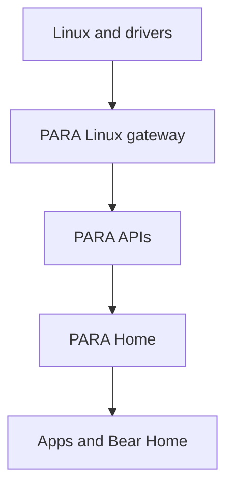

# PARA Project Guide

## Purpose

PARA 0.2.0 is the first working skeleton of a Linux-powered home console/PC
shell. Linux remains the operating system and supplies processes, graphics,
input, filesystems, networking, device discovery, and drivers. PARA supplies a
controller-first consumer interface and narrow service boundaries over those
Linux capabilities.

The current repository boots through the reserved PARA startup sequence,
completes a seven-step first-time setup, supports local profile selection, opens
PARA Home, lists only applications the current runtime can actually open, and
provides a spatial Bear Home file explorer over real user directories and
mounted media. No fictional catalog, application, download, network, storage,
or success data is used.

Features without an operational provider are kept out of the consumer route
graph. Their service contracts remain documented for later implementation.

## Safety

The normal launcher is safe to run on a development PC:

- It binds to `127.0.0.1` by default.
- It does not edit a bootloader, `/boot`, partitions, filesystems, firmware,
  BIOS/UEFI, kernel modules, graphics drivers, or the existing desktop.
- It does not install or enable systemd units.
- It does not format, erase, mount, eject, copy, move, rename, or delete files.
- The gateway reads unprivileged Linux information. Linux app launch is off
  unless the developer explicitly sets `PARA_ENABLE_APP_LAUNCH=1`.
- Hosted Render instances cannot launch host applications and cannot see files
  from the viewer's computer.
- Session preferences are the only browser data written by PARA Home.

Any future privileged capability must live in a separately reviewed service,
expose a narrow authenticated API, and use explicit Linux policy such as
polkit. The UI process must never receive unrestricted root access.

## Required architecture views

```text
Linux
  ↓
PARA system services
  ↓
PARA Home
  ↓
Games / Apps
```

```text
Hardware
  ↓
Linux drivers
  ↓
PARA hardware services
  ↓
Applications
```

The implemented boundary is:



Linux is the source of truth. PARA does not maintain a second fictional view of
installed software, user directories, storage, network interfaces, controllers,
or system identity.

## Repository tree

Build output, Git metadata, compiler targets, and Python caches are omitted.

```text
PARA/
├── .gitignore
├── Makefile
├── PROJECT_GUIDE.md
├── README.md
├── VERSION
├── render.yaml
├── apps/
│   └── para-home/
│       ├── assets/
│       │   ├── bear-home-room.png
│       │   └── para-home-background.png
│       ├── index.html
│       ├── styles.css
│       └── src/
│           ├── app.js
│           ├── focus-manager.js
│           ├── gamepad.js
│           ├── router.js
│           ├── screen-manifest.js
│           ├── services/para-api.js
│           ├── state.js
│           ├── screens/
│           │   ├── auth.js
│           │   ├── boot.js
│           │   ├── home.js
│           │   ├── libraries.js
│           │   └── system.js
│           └── ui/components.js
├── config/services.json
├── interfaces/openapi.yaml
├── packages/para-protocol/
│   ├── package.json
│   └── src/index.ts
├── platform/linux/
│   ├── session/para-home-session.sh
│   └── systemd/user/
│       ├── para-gateway.service
│       └── para-home.target
├── recovery/safe-recovery.sh
├── schemas/accounts.sql
├── scripts/
│   ├── check.sh
│   ├── dev.sh
│   ├── native-check.sh
│   ├── render-smoke.sh
│   ├── render-start.sh
│   └── smoke.sh
├── services/
│   ├── gateway/
│   │   ├── server.py
│   │   └── system_layer.py
│   ├── native/
│   │   ├── optical-disc/
│   │   ├── para-hardwared/
│   │   └── pulsewave-controller/
│   └── specs/
│       ├── accounts.toml
│       ├── bear-home.toml
│       ├── hardware.toml
│       ├── network.toml
│       ├── optical.toml
│       ├── parastore.toml
│       ├── pulsewave.toml
│       ├── recovery.toml
│       ├── security.toml
│       ├── updates.toml
│       └── vrus.toml
├── tests/
│   ├── test_api.py
│   └── test_repository.py
└── tools/
    ├── audit_consumer_ui.mjs
    ├── package_release.py
    ├── paractl.py
    └── validate_project.py
```

## Top-level folders

| Folder | What it does / why PARA needs it | Technology | Status | Next work and communication |
|---|---|---|---|---|
| `apps/` | Contains the consumer shell. Keeping presentation separate prevents normal UI code from acquiring system privileges. | HTML, CSS, JavaScript ES modules | Working. | Package as a dedicated Linux session after compositor and sandbox decisions. Calls only `services/para-api.js`. |
| `config/` | Machine-readable inventory of current and reserved service domains. | JSON | Working and validated. | Add a JSON Schema, dependency versions, and capability negotiation. Read by repository tooling. |
| `interfaces/` | Language-neutral HTTP contract for the Linux gateway. | OpenAPI 3.1 YAML | Matches the current gateway. | Add schemas, error models, event streams, and a D-Bus contract. Communicates with client generation and tests. |
| `packages/` | Shared type definitions for applications, controllers, services, and API paths. | TypeScript | Types are usable; no published package yet. | Generate types from OpenAPI and publish versioned internal packages. |
| `platform/` | Opt-in Linux session and user-service examples. | systemd user units, Bash | Examples only; never installed automatically. | Add distro packaging, a dedicated Wayland session, sandboxing, and reviewed policies. |
| `recovery/` | Keeps recovery as a separate trust boundary. | Bash | Harmless information command works. | Add signed offline repair and rollback only after dedicated-hardware testing. |
| `schemas/` | Reserves structured local profile/preferences storage without mixing it into UI state. | SQL | Design contract only; not executed. | Add migrations, encryption decisions, retention policy, and a real account service. |
| `scripts/` | Provides consistent run, validation, smoke, Render, and native checks. | Bash | Working without root. | Add CI, reproducible toolchains, linting, accessibility automation, and release signing. |
| `services/` | Holds the working Linux gateway, native interface boundaries, and future service contracts. | Python, Rust, C++, C, TOML | Gateway works read-only; native boundaries are interface-only. | Move stable operations behind versioned D-Bus services and least-privilege policies. |
| `tests/` | Protects API truthfulness, route coverage, assets, service safety, and removal of retired routes. | Python `unittest` | Working through `make check`. | Add browser interaction, accessibility-tree, visual-regression, fuzz, and hardware tests. |
| `tools/` | Holds validation, auditing, packaging, and operator inspection outside the consumer shell. | Python, JavaScript | Working. | Add deterministic packages, SBOM/signatures, generated clients, and release metadata. |

## Important root files

| File | What / why | Technology | Status | Next work / communicates with |
|---|---|---|---|---|
| `.gitignore` | Excludes caches, build directories, generated archives, and native check output. | Git patterns | Working. | Extend when new toolchains are added. |
| `Makefile` | Stable entry points: `dev`, `check`, `smoke`, `render-check`, `native-check`, and `package`. | Make | Working. | Add release, formatting, coverage, and client-generation targets. Delegates to `scripts/` and `tools/`. |
| `README.md` | Short run/deploy handoff. | Markdown | Current. | Add screenshots and distro compatibility after real hardware testing. |
| `PROJECT_GUIDE.md` | Complete architecture and file-by-file status. | Markdown + Mermaid | Current. | Keep synchronized with routes, service specs, and deployment behavior. |
| `VERSION` | Single source for gateway and archive version. | Plain text | `0.2.0`. | Automate from signed releases later. |
| `render.yaml` | Render Blueprint build, start, and health-check configuration. | YAML | Working. | Add a production observability policy if PARA is publicly operated. Calls `scripts/render-start.sh`. |

## PARA Home frontend

| File | What / why | Technology | Status | Next work / communicates with |
|---|---|---|---|---|
| `apps/para-home/index.html` | Minimal full-screen launch document and accessibility live regions. | HTML5 + ES modules | Working. | Add production preload/local font policy. Loads `styles.css` and `src/app.js`. |
| `assets/para-home-background.png` | Independent purple planet artwork behind real Home controls. | PNG | Working. | Add optimized WebP/AVIF/HDR variants and licensed source records. Used only by `home.js`. |
| `assets/bear-home-room.png` | Clean 1672×941 room + furniture + PARA bear with zero baked interface. | PNG | Working and preserved byte-for-byte from the supplied art. | Add separate animation layers when proper assets exist. Used only by `libraries.js`. |
| `styles.css` | Complete consumer design system: black/purple atmosphere, translucent panels, console spacing, 180–250 ms focus motion, disabled states, setup, apps, Bear Home, and system pages. | Modern responsive CSS | Working. | Add local fonts, HDR tokens, localization stress tests, and performance budgets. |
| `src/app.js` | Runtime composition, route transitions, actions, live screen detection, controller prompts, and service activation. | JavaScript | Working. | Split domain controllers and add typed error boundaries. Talks to every screen, router, input, state, and API adapter. |
| `src/router.js` | Restricts navigation to the screen manifest and keeps an in-shell back stack. | JavaScript + hash routing | Working. | Add route guards and activity suspension when real games/apps exist. |
| `src/focus-manager.js` | Geometry-based directional focus, pointer focus, Tab compatibility, Enter, Escape, Menu, and shoulder navigation. | JavaScript DOM APIs | Working. | Add wrap policies, virtual lists, RTL, focus groups, and announcements. |
| `src/gamepad.js` | Normalizes Browser Gamepad input and detects Xbox, PlayStation, Nintendo, or PARA/generic prompt styles. | JavaScript Gamepad API | Working when the browser exposes a controller. | Connect to a native controller service for remapping, battery, haptics, and hotplug metadata. |
| `src/state.js` | Stores first boot, local session, active profile, UI accessibility choices, display density, and selected Bear Home collection. | JavaScript `localStorage` | Working for local preferences; not an identity store. | Migrate to a versioned profile service with safe migrations. |
| `src/screen-manifest.js` | Authoritative set of 21 reachable screens. Retired routes are absent. | JavaScript | Working and validated. | Add capability-gated route registration for installed integrations. |
| `src/services/para-api.js` | One client boundary for applications, app launch, system, storage, network, directories, files, and health. | JavaScript Fetch API | Working. | Generate it from OpenAPI and add typed cancellation/retry policy. Talks only to `/api/v1`. |
| `src/ui/components.js` | Shared brand, living background, page frame, tiles, list rows, toggles, progress, and dynamic controller legends. | JavaScript templates | Working. Controls without a route or action render disabled. | Move to tested Web Components or another compositor-compatible UI toolkit. |
| `src/screens/boot.js` | Startup, five reserved intro stages, and Welcome → Display → Network → Accessibility → Privacy → Account/Profile → Ready setup. | JavaScript + CSS animation | Working. Display/network values are live; final rendered startup assets do not exist yet. | Replace each animation stage without changing routing; add real calibration providers. |
| `src/screens/auth.js` | “Who’s playing?”, Player One, Guest, selected-profile Continue, and Switch Profile. | JavaScript | Working as a local session flow. | Add a genuine identity provider before exposing PIN, recovery, or remote accounts. |
| `src/screens/home.js` | PARA Home with exactly Continue, Explore, Create, Community, and System; live storage/network/system data; apps/files/settings shortcuts. | JavaScript + inline SVG | Working. Explore and System route; unsupported primary cards are gracefully disabled. | Enable cards only when their providers return operational capabilities. |
| `src/screens/libraries.js` | Installed Apps from the gateway, real launch routing, the clean Bear Home scene, seven spatial hotspots, and read-only file lists. | JavaScript | Working. Bear Home is one app, and no dead Get Apps control is shown. | Add file opening via portals, indexed media, thumbnails, and mounted-volume navigation after permission design. |
| `src/screens/system.js` | Quick menu, controller state, storage, settings, display, accessibility, network, account, power, health, and recovery. | JavaScript | Working with live/read-only information and local interface actions. | Add new pages only when a real system provider and safe action contract exist. |

## Frontend navigation

```text
Startup
   ↓
First boot complete?
   ├─ No → Intro animation → Setup Wizard → PARA Home
   └─ Yes
        ↓
Logged in?
   ├─ No → Profile Selection → Login
   └─ Yes → PARA Home
```

PARA Home retains the required five primary cards:

- `Continue` — disabled until the system reports resumable activity.
- `Explore` — opens the actual installed-app library.
- `Create` — disabled until creator applications are available through the
  application service.
- `Community` — disabled until a real communication provider exists.
- `System` — opens working settings and system information.

Reachable screens are Startup, Intro, Setup, Login, Profiles, Home, Apps, Bear
Home, Files, Downloads, Quick Menu, Controllers, Storage, Settings, Display,
Accessibility, Network, Account, Power, Repair & Health, and Recovery.

Input mapping:

- D-pad / left stick or Arrow keys: nearest control in that direction.
- Connected controller primary control or Enter: select.
- Connected controller back control or Escape: back.
- Menu or keyboard `M`: quick menu.
- Shoulder buttons or Page Up/Page Down: switch major sections.
- Tab / Shift+Tab: browser focus order.
- Pointer hover/click: the same controls as keyboard/controller.

Prompt labels are controller-aware. Xbox uses A/B/X/Y, PlayStation symbols are
shown only for an identified PlayStation controller, Nintendo uses its layout,
and generic/PARA controls use Blue/Red/Green/Yellow names.

## Bear Home architecture

The background image contains no controls. `libraries.js` overlays seven semantic
buttons on TV, disc shelf, record player, desk, door, under-stairs storage, and
the PARA bear. Their percentage coordinates remain aligned because the stage is
locked to the artwork's 1672:941 aspect ratio and uses `object-fit: contain`.

Labels are hidden until hover/focus. The shared focus manager compares element
geometry, so directional input chooses the nearest object in the requested
direction instead of walking an arbitrary list. Selecting a category asks the
gateway for the corresponding XDG directory or mounted-media collection.

## Backend and Linux gateway

| File | What / why | Technology | Status | Next work / communicates with |
|---|---|---|---|---|
| `services/gateway/server.py` | Serves static PARA Home plus the versioned API, security headers, bind policy, request validation, and optional app launch. | Python standard library HTTP server | Working. | Replace the server transport for production scale while retaining the API and safety policy. Calls `system_layer.py`. |
| `services/gateway/system_layer.py` | Reads platform identity, disk usage, `/proc/mounts`, `/sys/class/net`, XDG directories, `.desktop` entries, icons, and exact app launch targets. | Python standard library + Linux files/APIs + `gio` | Working read-only; app launch is explicit local opt-in. | Move domains to narrow D-Bus services, portals, udev/udisks2, and event-driven updates. |
| `interfaces/openapi.yaml` | Contract for all gateway endpoints. | OpenAPI 3.1 | Current. | Add complete component schemas and generated clients. |
| `packages/para-protocol/src/index.ts` | Shared API/controller/application types. | TypeScript | Current source package. | Generate from OpenAPI and publish internally. |
| `config/services.json` | Declares operational and contract-only domains. | JSON | Working. | Add schema validation and runtime capability discovery. |

Application discovery is intentionally conservative. Linux `.desktop` entries
are returned only when all of these are true:

1. PARA is bound locally.
2. `PARA_ENABLE_APP_LAUNCH=1` was explicitly set.
3. `gio` exists.
4. The entry is visible, identifies an application, and satisfies `TryExec`.

The server stores the exact discovered desktop-file path internally. The client
submits only the returned identifier, and the gateway launches only a currently
rediscovered exact entry. It does not execute shell text from the UI.

## Native and service-boundary files

| File | PARA role | Language | Status | Eventual addition / communication |
|---|---|---|---|---|
| `services/native/para-hardwared/src/main.rs` | Demonstrates safe procfs/sysfs discovery without writes. | Rust | Working read-only probe. | D-Bus hardware capability service over udev, hwmon, and UPower. |
| `services/native/para-hardwared/Cargo.toml` | Rust crate definition. | TOML/Cargo | Working. | Add dependencies only when a real daemon is designed. |
| `services/native/pulsewave-controller/src/main.cpp` | Declares the native controller boundary without claiming devices. | C++17 | Interface-only executable. | BlueZ/evdev/hidraw adapter, SDL mappings, permissions, haptics, and firmware policy. |
| `services/native/pulsewave-controller/CMakeLists.txt` | Builds the controller boundary. | CMake | Working. | Tests, sanitizers, packaging, and daemon install rules after implementation. |
| `services/native/optical-disc/src/main.c` | Declares the optical boundary while reusing Linux optical drivers. | C11 | Interface-only executable. | udev/udisks2 discovery, safe mount/eject policy, media handoff, and error reporting. |
| `services/native/optical-disc/CMakeLists.txt` | Builds the optical boundary. | CMake | Working. | Tests and packaging after operations exist. |

Service specs are honest design contracts and are not rendered in the consumer
UI:

| Spec | Current status | Eventually communicates with |
|---|---|---|
| `accounts.toml` | Local session | Identity broker, encrypted tokens, parental controls. |
| `bear-home.toml` | Read-only | XDG directories, udisks2, indexing, portals. |
| `hardware.toml` | Read-only | udev, sysfs, procfs, UPower, hwmon. |
| `network.toml` | Read-only | Permission-aware network service when configuration is allowed. |
| `optical.toml` | Mounted-media read-only | udev, udisks2, existing SCSI/UDF drivers. |
| `pulsewave.toml` | Browser Gamepad | Native controller daemon and shared mapping database. |
| `recovery.toml` | Interface actions | Signed recovery image and verified rollback. |
| `parastore.toml` | Contract only; no route | Signed catalog, packages, entitlements, payments, moderation. |
| `security.toml` | Contract only; no route | polkit, systemd sandboxing, Landlock/bubblewrap, signature verification. |
| `updates.toml` | Contract only; no route | Signed atomic updater with rollback. |
| `vrus.toml` | Contract only; no route | OpenXR, PipeWire, Wayland, and capability-scoped Bear Home data. |

## Other important platform files

| File | What / why | Technology | Status | Next work / communicates with |
|---|---|---|---|---|
| `platform/linux/systemd/user/para-gateway.service` | Hardened user-service template for a future local install. | systemd | Template only and never enabled automatically. | Package with reviewed paths and desktop-session integration. Starts the gateway locally. |
| `platform/linux/systemd/user/para-home.target` | Groups future PARA user services. | systemd | Template only. | Add explicit dependencies after services exist. |
| `platform/linux/session/para-home-session.sh` | States that the current desktop remains untouched. | Bash | Working information command. | Replace with a dedicated opt-in Wayland session launcher after testing. |
| `recovery/safe-recovery.sh` | Lists destructive categories kept disabled and points to repository diagnostics. | Bash | Working and non-destructive. | Signed offline repair tooling. |
| `schemas/accounts.sql` | Proposed local profile and preference tables without secrets/payment data. | SQL | Not executed. | Migration runner, encryption policy, ownership, and retention rules. |

## Developer and validation files

| File | What / why | Technology | Status | Next work / communicates with |
|---|---|---|---|---|
| `scripts/dev.sh` | Starts the loopback gateway; optional app launch requires an environment flag. | Bash | Working. | Live reload and structured logging. |
| `scripts/render-start.sh` | Binds to Render's `PORT` with explicit nonlocal permission and no app launching. | Bash | Working. | Replace transport only if traffic requires it. |
| `scripts/check.sh` | Runs structural validation, consumer-copy audit, unit tests, shell syntax, and Python compilation. | Bash | Working. | Add CSS/JS lint, browser accessibility, and contract diffs. |
| `scripts/smoke.sh` | Starts a temporary local gateway and checks health. | Bash + Python | Working. | Add endpoint and concurrency checks. |
| `scripts/render-smoke.sh` | Tests the hosted start path and security headers on loopback. | Bash + Python | Working. | Add static cache and graceful-shutdown checks. |
| `scripts/native-check.sh` | Compiles native boundaries when compilers are installed. | Bash | Working; skips absent optional compilers. | Add CMake presets, clippy, sanitizers, and cross-builds. |
| `tools/validate_project.py` | Enforces routes, services, specs, required files, and absence of destructive script patterns. | Python | Working. | Validate JSON/OpenAPI schemas and cross-file links. |
| `tools/audit_consumer_ui.mjs` | Renders every screen and setup step, then rejects engineering copy or dead-action markers. | JavaScript | Working when Node is installed. | Add browser accessibility-tree and localization audits. |
| `tools/paractl.py` | Reads health, system, storage, network, apps, and directory endpoints. | Python | Working against a running gateway. | Add D-Bus/event inspection once native services exist. |
| `tools/package_release.py` | Produces a source archive while excluding Git, caches, builds, and prior archives. | Python | Working. | Add reproducible timestamps, checksums, SBOM, and signatures. |
| `tests/test_api.py` | Verifies gateway health, host-backed values, hidden app launch, 404s, and public-bind policy. | Python `unittest` | Working. | Add malformed input, concurrency, and fuzz tests. |
| `tests/test_repository.py` | Verifies route renderers, exact clean Bear art, seven hotspots, five Home cards, Render wiring, and retired-code removal. | Python `unittest` | Working. | Add DOM interaction and visual-regression tests. |

## Build and run

### Required dependencies

- Python 3.11 or newer.
- Bash 4+ and Make.
- A current browser with JavaScript modules.

Node is optional and enables the consumer-copy audit. Rust/Cargo, a C11
compiler, a C++17 compiler, and CMake are optional for native checks. No npm
install, database, Supabase project, secret, root access, or kernel headers are
required for PARA Home.

### Run locally

```bash
cd PARA
make dev
```

Open `http://127.0.0.1:4173`.

Replay first boot:

```text
http://127.0.0.1:4173/?reset=1
```

The reserved startup sequence is:

```text
fade-in → purple and white liquid mixing → water splash revealing the PARA logo
→ logo melting into a circle → 3D circle reacting to a beat → setup screen
```

### Show and launch installed Linux desktop apps

This is local-only and explicitly opt-in:

```bash
PARA_ENABLE_APP_LAUNCH=1 make dev
```

Without that flag, Apps contains only working built-in PARA applications, which
currently means Bear Home. Render never enables Linux application launching.

### Validate

```bash
make check
make smoke
make render-check
make native-check
```

### Package

```bash
make package
```

The archive is written to `dist/PARA-0.2.0.zip`.

## Render deployment

Push the repository to GitHub, create a Render Blueprint, and select this repo.
The included settings are:

- Build command: `python3 tools/validate_project.py`
- Start command: `./scripts/render-start.sh`
- Health check: `/api/v1/health`

No environment variables or Supabase keys are required. Render supplies `PORT`
automatically. The hosted interface can show Bear Home and its layout, but it
cannot read a viewer's directories or launch a viewer's Linux applications;
those capabilities require the local gateway on that machine.

## Current limitations

- PARA Home currently runs in a browser, not a dedicated Wayland session.
- The intro reserves the required stages with CSS; final rendered audio/video or
  WebGL assets do not exist.
- Local profiles are session preferences, not authenticated identities.
- Bear Home reads directory names and file metadata but does not open or mutate
  files.
- External and optical media are shown only after Linux has mounted them.
- Linux application discovery/launch is intentionally disabled unless explicitly
  enabled on a loopback run.
- Continue, Create, and Community remain disabled until operational activity,
  creator-app, and communication providers exist.
- ParaStore, remote accounts, purchases, downloads/installation, updates,
  VR-US, social communication, native PulseWave operations, optical controls,
  and privileged recovery are not exposed.
- Screen reader, captions, controller assistance, HDR calibration, safe-area
  calibration, and native controller remapping need real system providers before
  they can be offered.

## Next milestones

1. Replace the standard-library HTTP transport with a typed local D-Bus/portal
   boundary while preserving the OpenAPI-compatible client contract.
2. Add safe document portals for opening selected files without broad filesystem
   access.
3. Build the installed-app service around desktop portals, application lifecycle,
   sandbox permissions, and capability reporting.
4. Add real media indexing/thumbnails and hotplug events for Bear Home.
5. Implement a native controller service using existing Linux input stacks and a
   shared mapping database.
6. Design signed package, update, entitlement, security, and recovery systems
   before exposing ParaStore or privileged controls.
7. Package PARA Home as an opt-in dedicated Linux session and test it on target
   hardware without replacing existing desktop sessions.
